---

---

9

# STL常用函数使用

## vector 容器

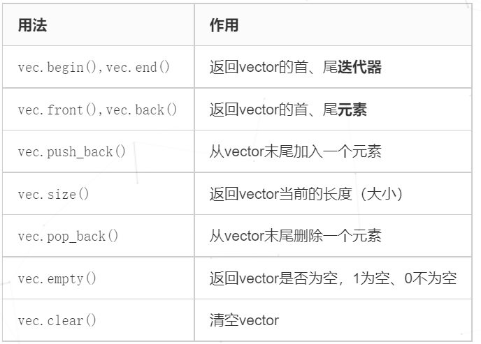

## queue容器适配器

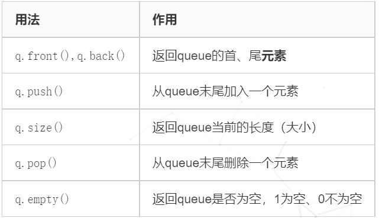

## stack容器适配器

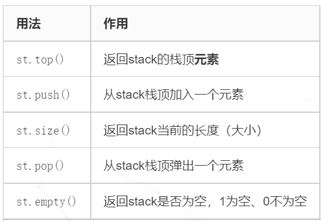

## string容器

- str.substr(i, j)取出在i到j区间内的字符元素。

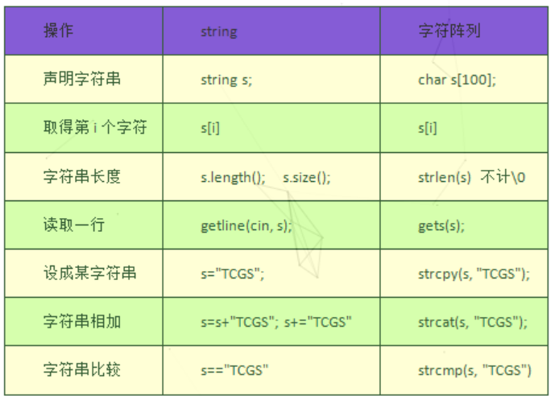

## priority_queue容器适配器

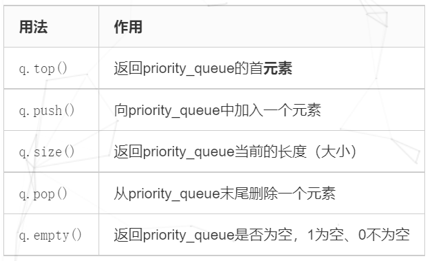

**注意：priority_queue取出队首元素是使用top，而不是front，这点一定要注意！！**


- 其实**就是一个披着队列外衣的堆**，
  因为优先级队列对外接口只是从队头取元素，从队尾添加元素，再无其他取元素的方式，看起来就是一个队列。
  缺省情况下priority_queue利用**max-heap（大顶堆）**完成对元素的排序，这个**大顶堆是以vector为表现形式的complete binary tree（完全二叉树）**。

- 什么是堆呢？
  **堆是一颗完全二叉树，树中每个结点的值都不小于（或不大于）其左右孩子的值。** 如果父亲结点是大于等于左右孩子就是大顶堆，小于等于左右孩子就是小顶堆。所以大家经常说的大顶堆（堆头是最大元素），小顶堆（堆头是最小元素），如果懒得自己实现的话，就直接用priority_queue（优先级队列）就可以了，底层实现都是一样的，从小到大排就是小顶堆，从大到小排就是大顶堆。
- 优先级队列的cmp函数与排序相反，例如写快排的cmp函数的时候，`return left>right` 就是从大到小，`return left<right` 就是从小到大。
- 传入比较结构体(或者定义一个类），自定义优先级。

```cpp
priority_queue<pair<int, int>, vector<pair<int, int>>, mycomparison> pri_que;
 // 小顶堆
class mycomparison {
    public:
    bool operator()(const pair<int, int>& lhs, const pair<int, int>& rhs) {
        return lhs.second > rhs.second;
    }
};
```

## deque容器

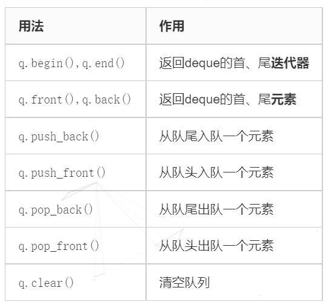

## set-map容器

```cpp
s.empty();
s.size();
s.clear();
s.begin(),s.end();
s.insert(k);
s.erase(k);
s.find(k);
```

# C++11新特性

https://cloud.tencent.com/developer/article/1745592

## auto 和 decltype

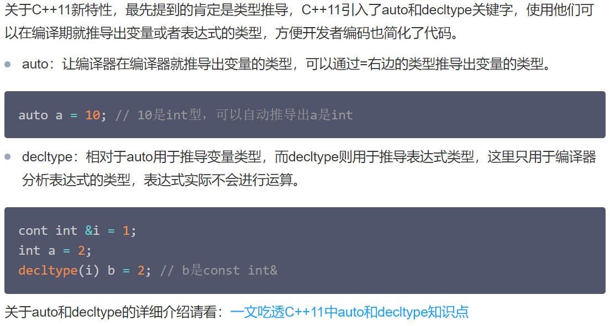

一般来说可以在模板类中这么用！！

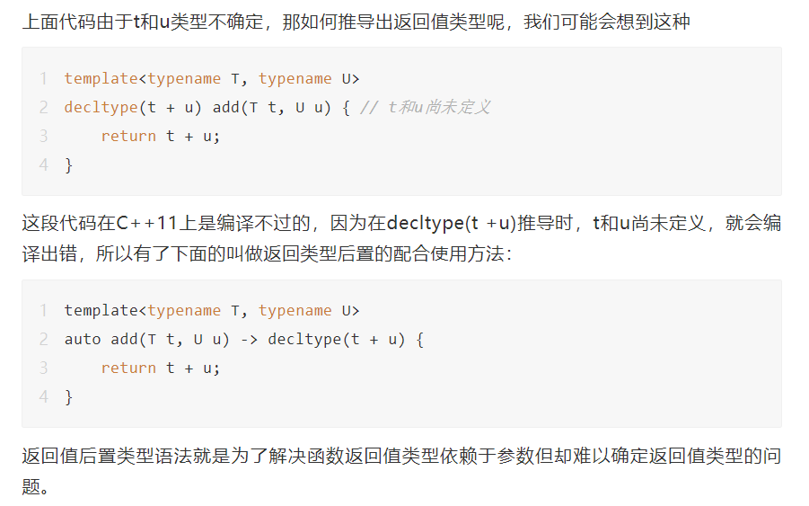

## 左值与右值

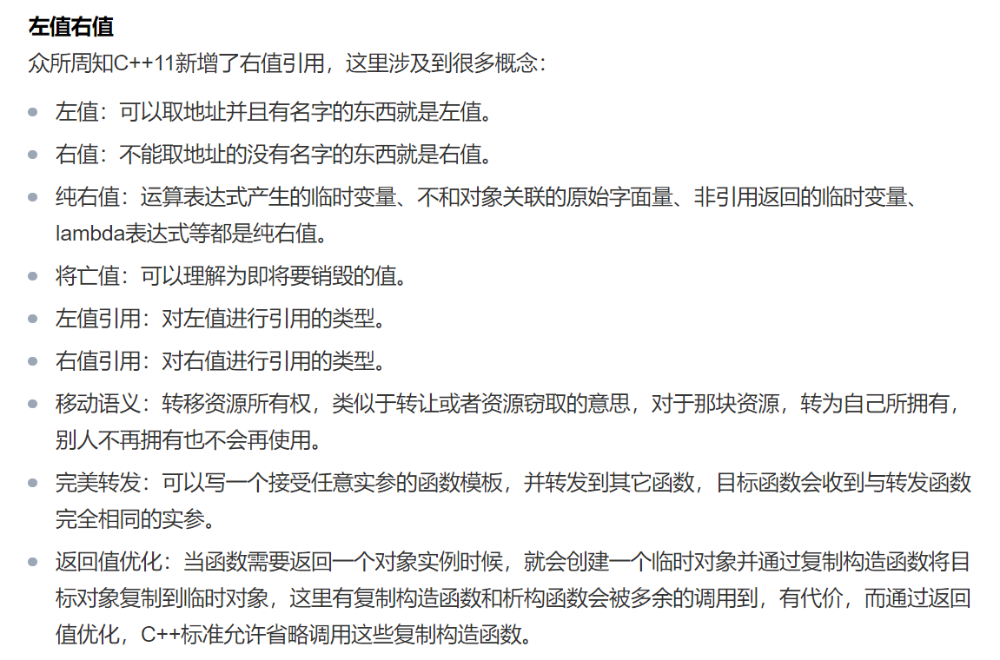

## lambda表达式

https://www.cnblogs.com/DswCnblog/p/5629165.html

C++11的一大亮点就是引入了Lambda表达式。利用Lambda表达式，可以方便的**定义和创建匿名函数**

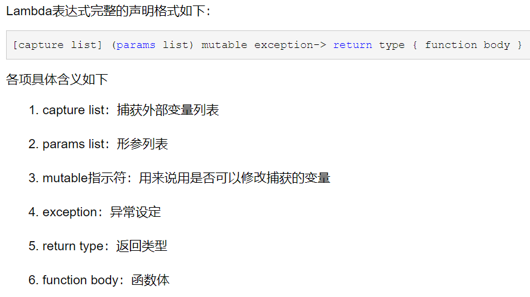

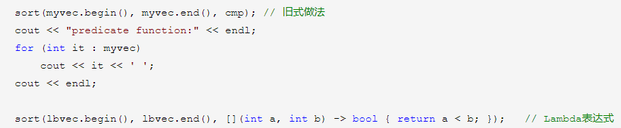

捕获外部变量常见的方式有：值捕获、引用捕获

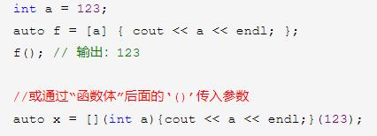

## std::move

把一个左值对象变成一个右值

```c++
void TestSTLObject()
{
    std::string str = "Hello";
    std::vector<std::string> v;

    v.push_back(str);
    std::cout << "After copy, str is \"" << str << "\"\n";

    v.push_back(std::move(str));
    std::cout << "After move, str is \"" << str << "\"\n";
    std::cout << "The contents of the vector are \"" << v[0]
                                         << "\", \"" << v[1] << "\"\n";
 
}
//输出
After copy, str is "Hello"
After move, str is "" //这里通过std::move已经讲原来的str变成了一个常量，放入了vector中，所以变成了空的！！！！
The contents of the vector are "Hello", "Hello"
```


## STL 的智能指针

https://blog.csdn.net/cpp_learner/article/details/118912592?spm=1001.2101.3001.6650.2&utm_medium=distribute.pc_relevant.none-task-blog-2%7Edefault%7EOPENSEARCH%7Edefault-2.no_search_link&depth_1-utm_source=distribute.pc_relevant.none-task-blog-2%7Edefault%7EOPENSEARCH%7Edefault-2.no_search_link

### 为什么要使用智能指针

一句话带过：智能指针就是帮我们C++程序员管理动态分配的内存的，它会帮助我们自动释放new出来的内存，从而**避免内存泄漏**！

如下例子就是内存泄露的例子：

```c++
#include <iostream>
#include <string>
#include <memory>
using namespace std;
// 动态分配内存，没有释放就return
void memoryLeak1() {
	string *str = new string("动态分配内存！");
	return;
}
// 动态分配内存，虽然有些释放内存的代码，但是被半路截胡return了
int memoryLeak2() {
	string *str = new string("内存泄露！");
	// ...此处省略一万行代码
	// 发生某些异常，需要结束函数
	if (1) {
		return -1;
	}
	// 另外，使用try、catch结束函数，也会造成内存泄漏！
	delete str;	// 虽然写了释放内存的代码，但是遭到函数中段返回，使得指针没有得到释放
	return 1;
}
int main(void) {
	memoryLeak1();
	memoryLeak2();
	return 0;
} 
```


memoryLeak1函数中，new了一个字符串指针，但是没有delete就已经return结束函数了，导致内存没有被释放，内存泄露！
memoryLeak2函数中，new了一个字符串指针，虽然在函数末尾有些释放内存的代码delete str，但是在delete之前就已经return了，所以内存也没有被释放，内存泄露！

使用指针，我们没有释放，就会造成内存泄露。但是我们使用普通对象却不会！

思考：如果我们分配的动态内存都交由有生命周期的对象来处理，那么在对象过期时，让它的析构函数删除指向的内存，这看似是一个 very nice 的方案？

**智能指针就是通过这个原理来解决指针自动释放的问题！**

### 智能指针起源

很多人谈到c++，说它特别难，可能有一部分就是因为c++的内存管理吧，不像java那样有虚拟机动态的管理内存，在程序运行过程中可能就会出现内存泄漏，然而这种问题其实都可以通过c++11引入的智能指针来解决，相反我还认为这种内存管理还是c++语言的优势，因为尽在掌握。

1. C++98 提供了 **auto_ptr** 模板的解决方案
2. C++11 增加**unique_ptr、shared_ptr 和weak_ptr**

C++11 后auto_ptr 已经被“抛弃”，已使用unique_ptr替代，**auto_ptr 被C++11抛弃的主要原因**

- [ ] 复制或者赋值都会改变资源的所有权

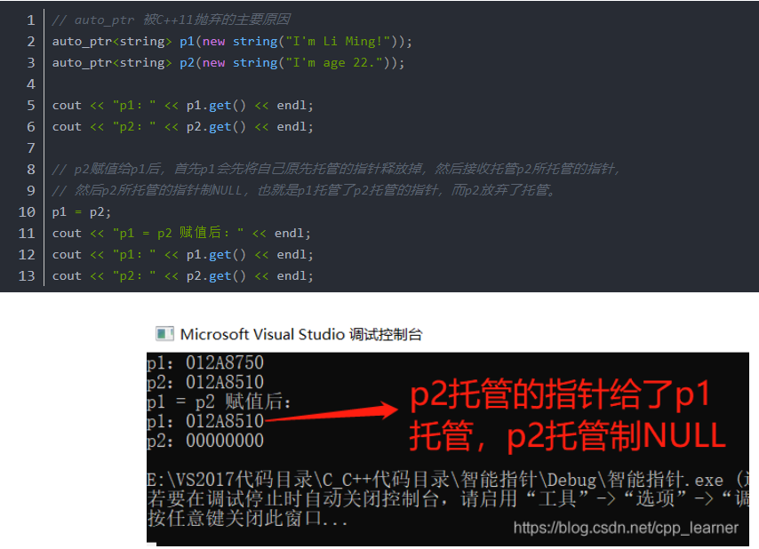

- [ ] 在STL容器中使用auto_ptr存在着重大风险，因为容器内的元素必须支持可复制和可赋值

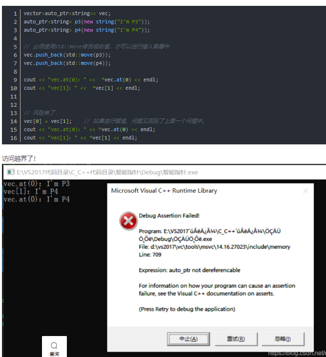

- [ ] 不支持对象数组的内存管理

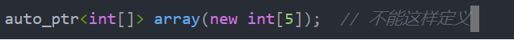

所以，C++11用更严谨的unique_ptr 取代了auto_ptr！

### unique_ptr

1. 基于排他所有权模式：两个指针不能指向同一个资源
2. 无法进行左值unique_ptr复制构造，也无法进行左值复制赋值操作，但允许临时右值赋值构造和赋值
3. 保存指向某个对象的指针，当它本身离开作用域时会自动释放它指向的对象。
4. 在容器中保存指针是安全的

**unique_ptr的特性所在**

 A.无法进行左值复制赋值操作，但允许临时右值赋值构造和赋值

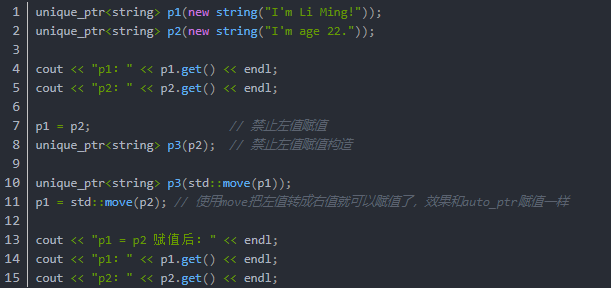

B.在 STL 容器中使用unique_ptr，不允许直接赋值（在auto_ptr中可以直接赋值，但是赋值以后后面一个指针就没有了），当然，运行后是直接报错的，因为vec[1]已经是NULL了，再继续访问就越界了。

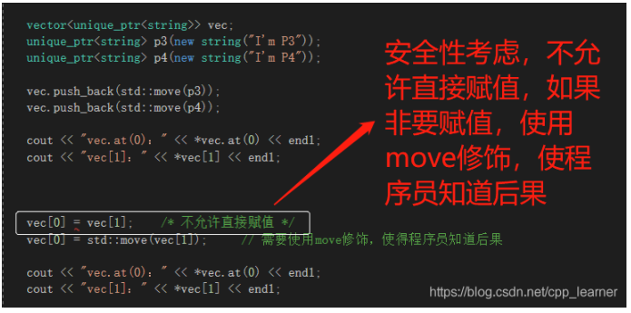

C.支持对象数组的内存管理

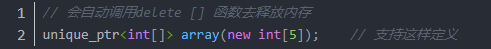

除了上面ABC三项外，unique_ptr的其余用法都与auto_ptr用法一致。

**常见的几种操作：**

1.构造

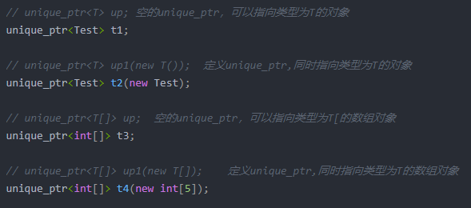

2.赋值，必须使用std::move来讲对象变为右值

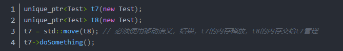

3.主动释放对象

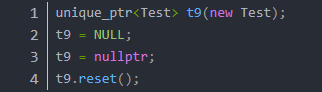

4.放弃对象的控制权

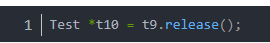

5.重置，就是把原来的智能指针指向的内存给分解了，然后重新托管一个参数指针。

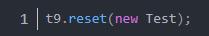

**auto_ptr 与 unique_ptr智能指针的内存管理陷阱**

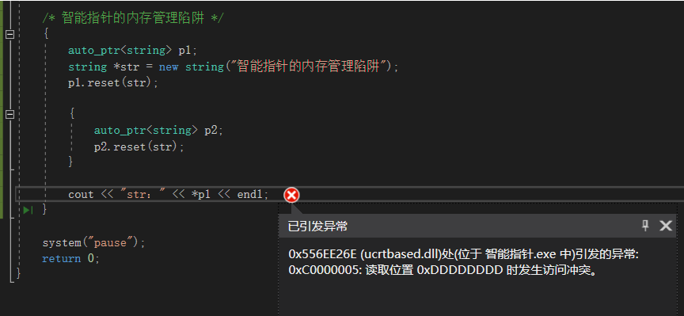

这是由于auto_ptr 与 unique_ptr的排他性所导致的！
**为了解决这样的问题，我们可以使用shared_ptr指针指针！**

### shared_ptr

熟悉了unique_ptr 后，其实我们发现unique_ptr 这种排他型的内存管理并不能适应所有情况，有很大的局限！如果需要多个指针变量共享怎么办？如果有一种方式，可以记录引用特定内存对象的智能指针数量，当复制或拷贝时，引用计数加1，当智能指针析构时，引用计数减1，如果计数为零，代表已经没有指针指向这块内存，那么我们就释放它！这就是 shared_ptr 采用的策略！

1.引用计数的使用，调用**use_count**函数可以获得当前托管指针的引用计数。

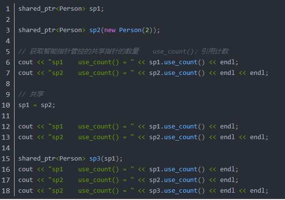

如上代码，sp1 = sp2; 和 shared_ptr< Person > sp3(sp1);就是在使用引用计数了。

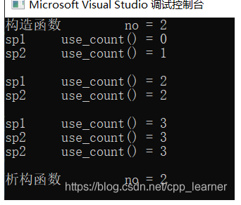


2.构造

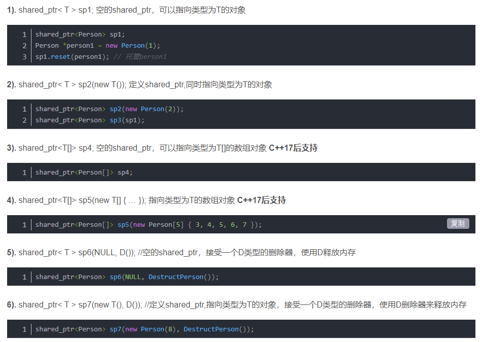

3.初始化

- 方式一：构造函数

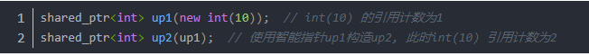

- 方式二：使用make_shared 初始化对象，分配内存效率更高**(推荐使用)**
  make_shared函数的主要功能是在动态内存中分配一个对象并初始化它，返回指向此对象的shared_ptr; 用法：
  make_shared<类型>(构造类型对象需要的参数列表);

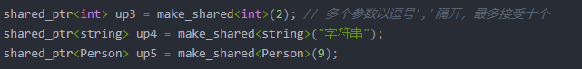

4.赋值

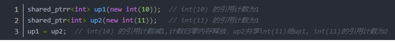

5.主动释放对象

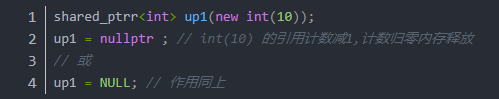

6.重置
p.reset() ; 将p重置为空指针，所管理对象引用计数 减1
p.reset(p1); 将p重置为p1（的值）,p 管控的对象计数减1，p接管对p1指针的管控
p.reset(p1,d); 将p重置为p1（的值），p 管控的对象计数减1并使用d作为删除器
p1是一个指针！

**ared_ptr使用陷阱**

shared_ptr作为被管控的对象的成员时，小心因循环引用造成无法释放资源!

如下代码：
Boy类中有Girl的智能指针；
Girl类中有Boy的智能指针；

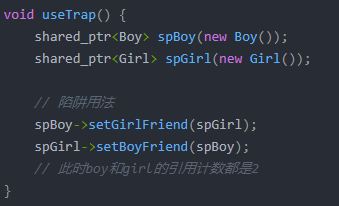

useTrap函数结束后，函数中定义的智能指针被清掉，boy和girl指针的引用计数减1，还剩下1，对象中的智能指针还是托管他们的，所以函数结束后没有将boy和gilr指针释放的原因就是于此。

**所以在使用shared_ptr智能指针时，要注意避免对象交叉使用智能指针的情况！** 否则会导致内存泄露！当然，这也是有办法解决的，那就是使用**weak_ptr**弱指针。

### weak_ptr

weak_ptr 设计的目的是为配合 shared_ptr 而引入的一种智能指针来**协助 shared_ptr 工作**, 它只可以从一个 shared_ptr 或另一个 weak_ptr 对象构造, 它的构造和析构不会引起引用记数的增加或减少。 同时weak_ptr 没有重载*和->但可以使用 lock 获得一个可用的 shared_ptr 对象。

1.弱指针的使用；
weak_ptr wpGirl_1; // 定义空的弱指针
weak_ptr wpGirl_2(spGirl); // 使用共享指针构造
wpGirl_1 = spGirl; // 允许共享指针赋值给弱指针

2.弱指针也可以获得引用计数；
wpGirl_1.use_count()

3.弱指针不支持 * 和 -> 对指针的访问；

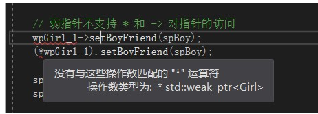

### 智能指针的陷阱

1. 不要把一个原生指针给多个智能指针管理;

   ```c++
   int *x = new int(10);
   unique_ptr< int > up1(x);
   unique_ptr< int > up2(x);
   ```

   // 警告! 以上代码使up1 up2指向同一个内存,非常危险
   或以下形式：

   ```c++
   up1.reset(x);
   up2.reset(x);
   ```

   

2. 记得使用u.release()的返回值;
   在调用u.release()时是不会释放u所指的内存的，这时返回值就是对这块内存的唯一索引，如果没有使用这个返回值释放内存或是保存起来，这块内存就泄漏了.

3. 禁止delete 智能指针get 函数返回的指针;
   如果我们主动释放掉get 函数获得的指针，那么智能 指针内部的指针就变成野指针了，析构时造成重复释放，带来严重后果!

4. 禁止用任何类型智能指针get 函数返回的指针去初始化另外一个智能指针！

   ```c++
   shared_ptr< int > sp1(new int(10));
   // 一个典型的错误用法 shared_ptr< int > sp4(sp1.get());
   ```

## 基于范围的for循环

```c++
vector<int> vec;
for (auto iter = vec.begin(); iter != vec.end(); iter++) { // before c++11
   cout << *iter << endl;
}
for (int i : vec) { // c++11基于范围的for循环
cout << "i" << endl;
}
```

## nullptr（c++新的空指针代替了原来的NULL)

nullptr是c++11用来表示空指针新引入的常量值，在c++中如果表示空指针语义时建议使用nullptr而不要使用NULL，因为NULL本质上是个int型的0，其实不是个指针。举例：

```C++
void func(void *ptr) {
   cout << "func ptr" << endl;
}
void func(int i) {
   cout << "func i" << endl;
}
int main() {
   func(NULL); // 编译失败，会产生二义性
   func(nullptr); // 输出func ptr
   return 0;
}
```

## final & override

c++11关于继承新增了两个关键字，final用于修饰一个类，表示禁止该类进一步派生和虚函数的进一步重载，override用于修饰派生类中的成员函数，标明该函数重写了基类函数，如果一个函数声明了override但父类却没有这个虚函数，编译报错，使用override关键字可以避免开发者在重写基类函数时无意产生的错误。

```C++
struct Base {
   virtual void func() {
       cout << "base" << endl;
  }
};
struct Derived : public Base{
   void func() override { // 确保func被重写
       cout << "derived" << endl;
  }
   void fu() override { // error，基类没有fu()，不可以被重写
  }
};
```

```C++
struct Base final {
   virtual void func() {
       cout << "base" << endl;
  }
};
struct Derived : public Base{ // 编译失败，final修饰的类不可以被继承
   void func() override {
       cout << "derived" << endl;
  }
};
```

## default

c++11引入default特性，多数时候用于声明构造函数为默认构造函数，如果类中有了自定义的构造函数，编译器就不会隐式生成默认构造函数，如下代码：

```C++
struct A {
   int a;
   A(int i) { a = i; }
};
int main() {
   A a; // 编译出错
   return 0;
}

struct A {
   A() = default;
   int a;
   A(int i) { a = i; }
};
int main() {
   A a;// 编译通过
   return 0;
}
```

## delete

c++中，如果开发人员没有定义特殊成员函数，那么编译器在需要特殊成员函数时候会隐式自动生成一个默认的特殊成员函数，例如拷贝构造函数或者拷贝赋值操作符，如下代码：

```c++
struct A {
   A() = default;
   A(const A&) = delete;
   A& operator=(const A&) = delete;
   int a;
   A(int i) { a = i; }
};
int main() {
   A a1;
   A a2 = a1;  // 错误，拷贝构造函数被禁用
   A a3;
   a3 = a1;  // 错误，拷贝赋值操作符被禁用
}
```

## constexpr

constexpr是c++11新引入的关键字，用于编译时的常量和常量函数，这里直接介绍constexpr和const的区别：

两者都代表可读，const只表示read only的语义，只保证了运行时不可以被修改，但它修饰的仍然有可能是个动态变量，而constexpr修饰的才是真正的常量，它会在编译期间就会被计算出来，整个运行过程中都不可以被改变，constexpr可以用于修饰函数，这个函数的返回值会尽可能在编译期间被计算出来当作一个常量，但是如果编译期间此函数不能被计算出来，那它就会当作一个普通函数被处理。

```c++
#include<iostream>
using namespace std;

constexpr int func(int i) {
   return i + 1;
}

int main() {
   int i = 2;
   func(i);// 普通函数
   func(2);// 编译期间就会被计算出来
}
```

## enum class

c++11新增有作用域的枚举类型，看代码

不带作用域的枚举代码

```c++
enum AColor {
   kRed,
   kGreen,
   kBlue
};
enum BColor {
   kWhite,
   kBlack,
   kYellow
};
int main() {
   if (kRed == kWhite) {
       cout << "red == white" << endl;
  }
   return 0;
}
```

如上代码，不带作用域的枚举类型可以自动转换成整形，且不同的枚举可以相互比较，代码中的红色居然可以和白色比较，这都是潜在的难以调试的bug，而这种完全可以通过有作用域的枚举来规避。

有作用域的枚举代码：

```c++
enum class AColor {
   kRed,
   kGreen,
   kBlue
};
enum class BColor {
   kWhite,
   kBlack,
   kYellow
};
int main() {
   if (AColor::kRed == BColor::kWhite) { // 编译失败
       cout << "red == white" << endl;
  }
   return 0;
}
```

# 数据结构

## 图论

### 广度优先遍历(BFS)

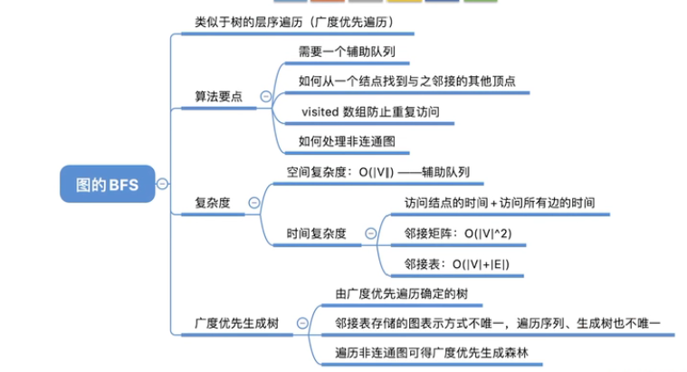

1.同一个图的邻接矩阵表示唯一，所以广度优先遍历序列**唯一**

2.同一个图的邻接表表示不唯一，所以广度优先遍历序列**不唯一**

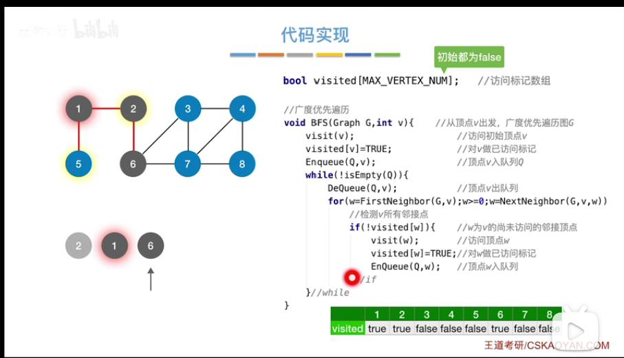

由于对于非联通图，前面的代码只能保证遍历完一个图，所以又引入了一个**额外的for循环来进行遍历两个图中所有的顶点**

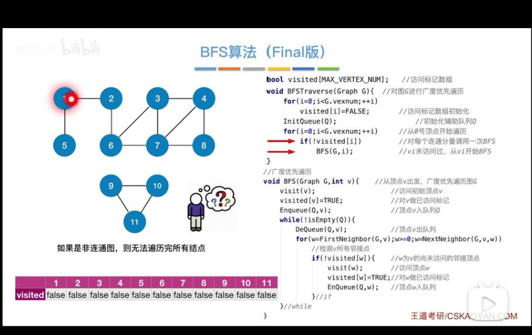

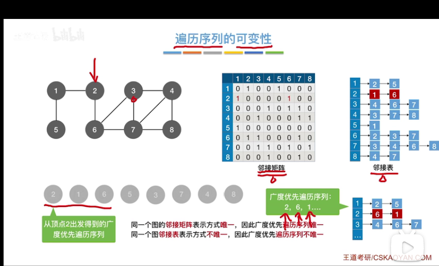

时间复杂度的分析

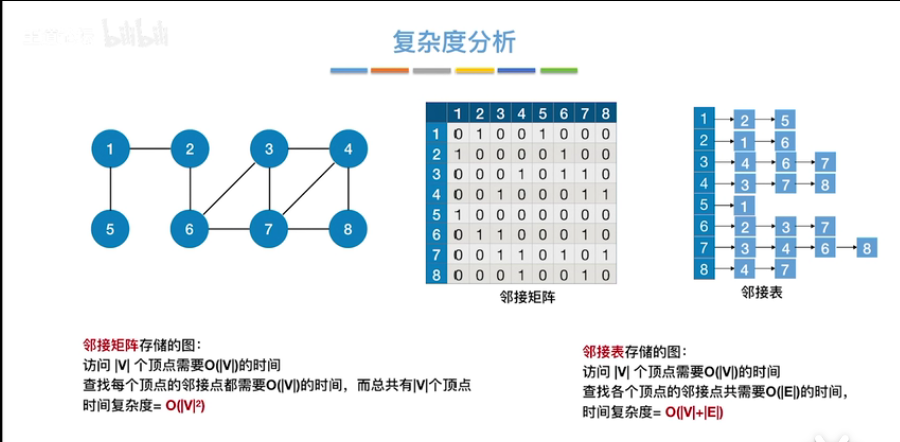

生成树是通过对于节点的遍历顺序来确定的。

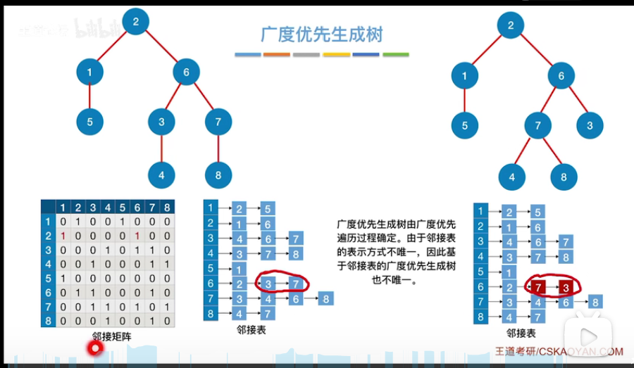

有向图必须用final版的BFS

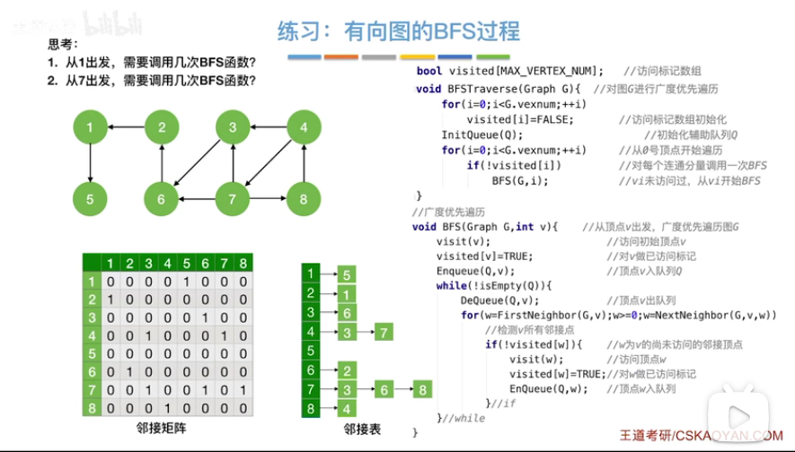

### 深度优先遍历(DFS)

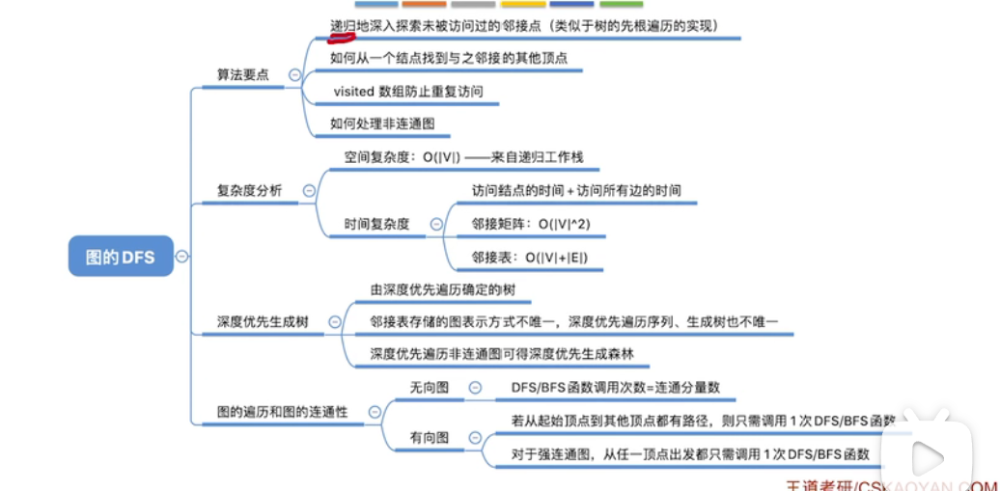

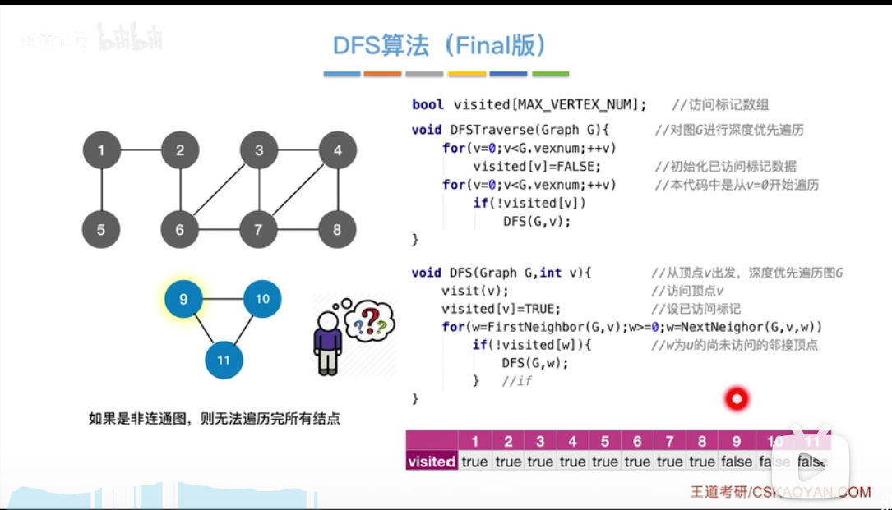

### 最小生成树(prim,kruskal)

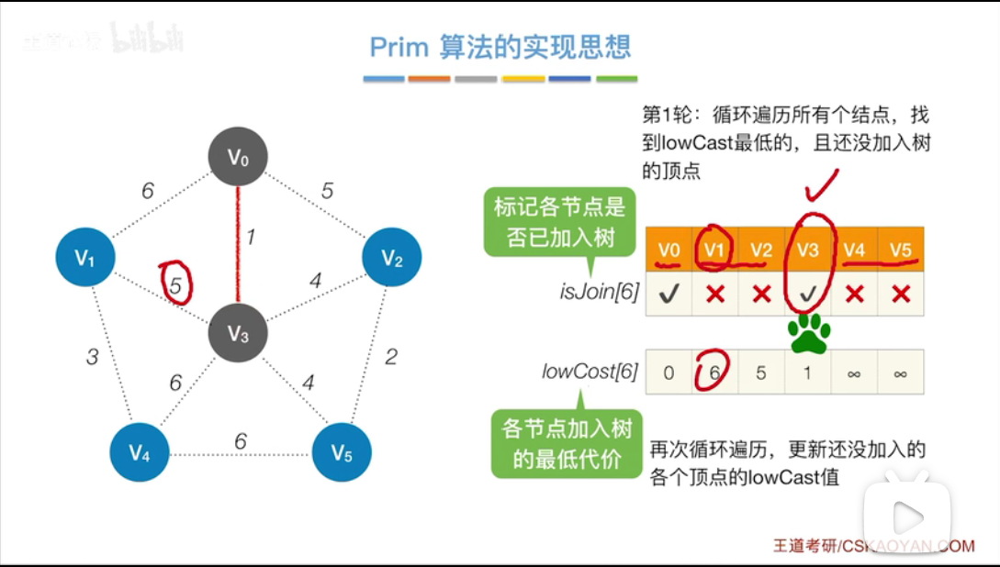

krukal中使用了并查集合的概念，主要流程就是每次选择两个边，并且判断两个边是否连通，也就是两个顶点是否属于同一个集合。

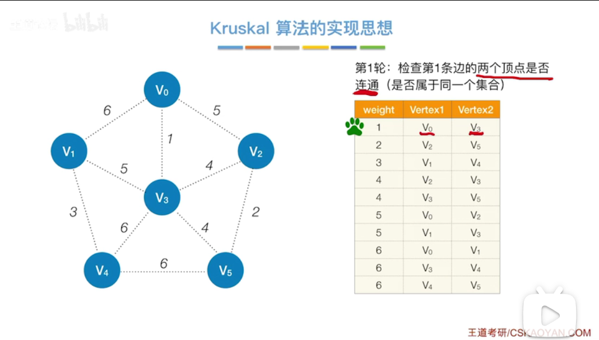

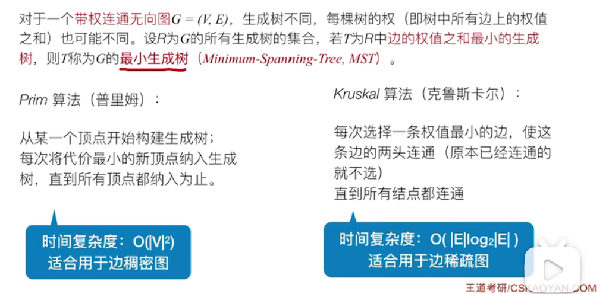

### 最短路径问题(bfs,djkstra,floyd)

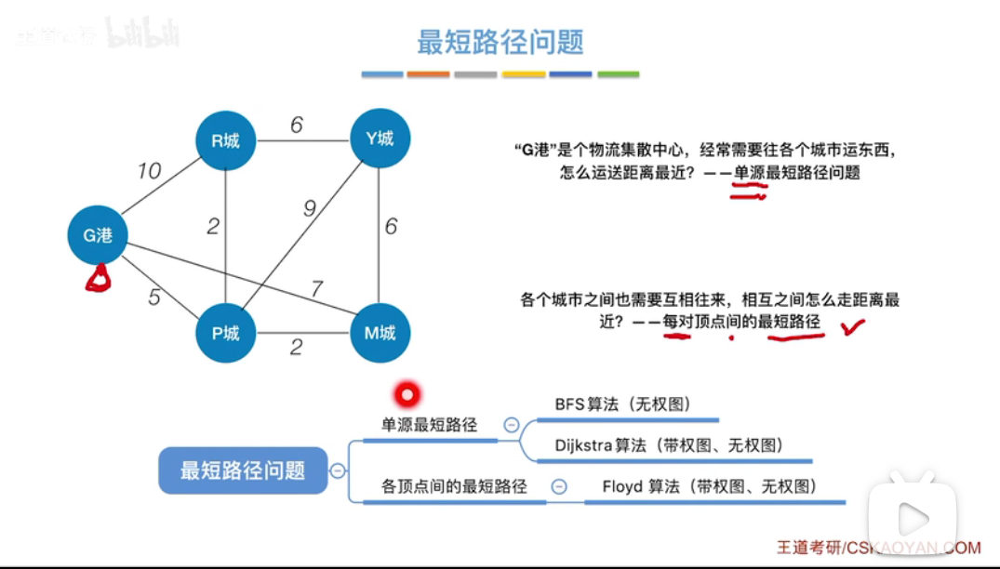

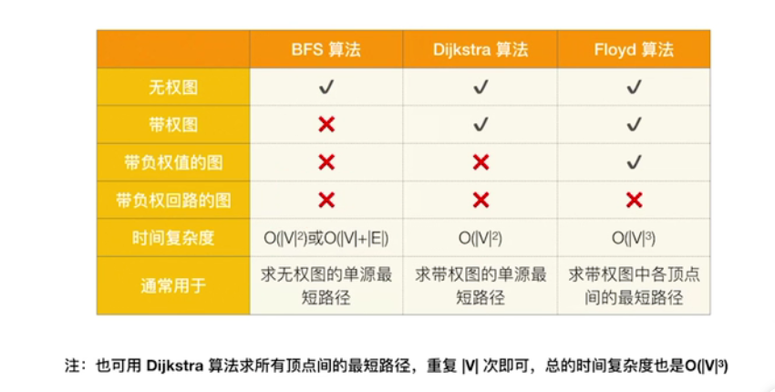


1. BFS算法：不带权值的最短路径，其实就是使用改造以后的BFS算法，这里需要定义两个数组，**一个记录权重，一个记录最短路径的来源。**

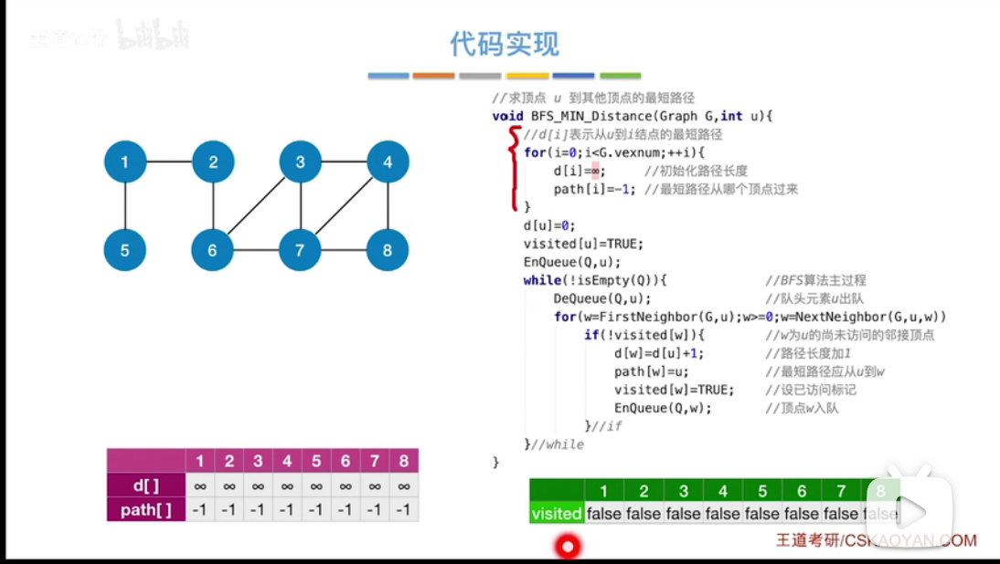

2.djkstra算法：只能计算**权值为正**的最短路径，prim算法和djkstra算法其实有类似，即代价数据和最短路径数组其实是一回事。

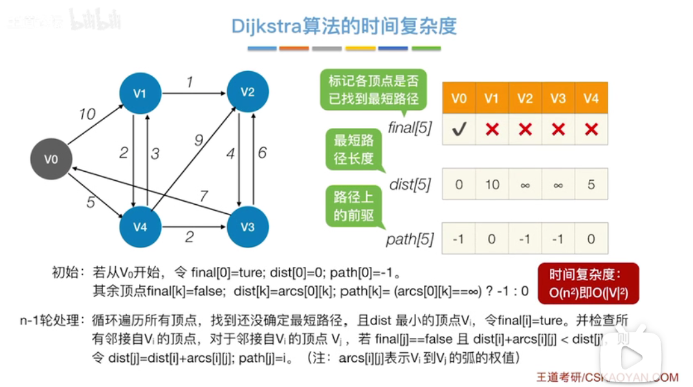

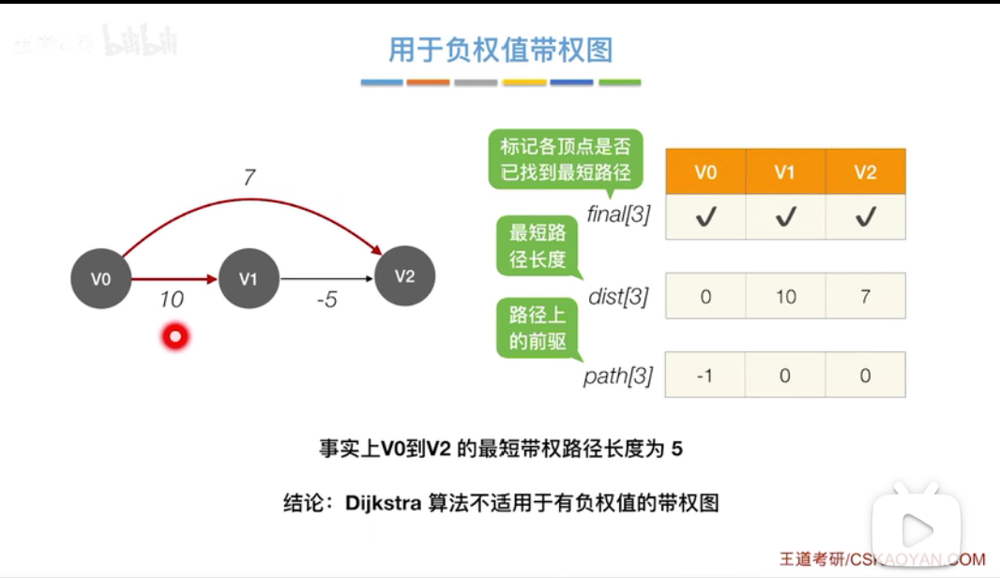

3.floyd算法


### 有向无环图(DAG,拓扑排序)


## 哈希表(hash table)

### 哈希表


### 哈希冲突

  


### 哈希函数

为了保证关键词尽可能的分布在不同的区间中，也就是通过哈希函数的映射以后，关键词尽可能的不发生哈希冲突（碰撞）。我们需要考虑设计不同的哈希函数来进行处理。常见的哈希函数有：


## 排序算法

### 算法的稳定性


### 插入排序


### 希尔排序


### 快速排序


### 堆排序(选择排序的一种)


### 堆的插入与删除


### 归并排序


### 基数排序


# LeedCode

## 常用函数

- int->sting: to_string(1)

## 数组


### 滑动窗口

滑动窗口一般情况下需要在一个while循环中进行，不断的动态调整窗口的起始位置。终止位置一般是通过一个全局循环来控制。


这种题一般使用字典+双指针+滑动窗口来实现


## 链表

移除链表元素，设置虚拟头节点的基本操作


翻转链表的递归操作**(这里还是比较难理解的)**


删除元素，记得需要定义一个虚拟节点，不然如果只有一个节点的时候，head->next = hexd->next->next是没有意义的


## 双指针法

### 三树之和


## 栈与队列

1. C++中stack 是容器么？
   栈是以底层容器完成其所有的工作，对外提供统一的接口，底层容器是可插拔的（也就是说我们可以控制使用哪种容器来实现栈的功能）。**所以STL中栈往往不被归类为容器，而被归类为container adapter（容器适配器）**。

2. 我们使用的STL中stack是如何实现的？

   我们常用的SGI STL，如果没有指定底层实现的话，**默认是以deque**为缺省情况下栈的低层结构。

   deque是一个双向队列，只要封住一段，只开通另一端就可以实现栈的逻辑了。

   SGI STL中 队列底层实现缺省情况下一样使用deque实现的

   我们也可以**指定vector为栈**的底层实现，初始化语句如下：

   ```c++
   std::stack<int, std::vector<int> > third;  // 使用vector为底层容器的栈
   std::queue<int, std::list<int>> third; // 定义以list为底层容器的队列
   ```

3. stack 提供迭代器来遍历stack空间么？

   栈提供push 和 pop 等等接口，所有元素必须符合先进后出规则，**所以栈不提供走访功能，也不提供迭代器(iterator)**。 不像是set 或者map 提供迭代器iterator来遍历所有元素。

### 用栈实现队列

```cpp
class MyQueue {
public:
    stack<int> stIn;
    stack<int> stOut;
    MyQueue() {
    }
    void push(int x) {
        stIn.push(x);
    }
    int pop() {
        // 只有当stOut为空的时候，再从stIn里导入数据（导入stIn全部数据）
        if (stOut.empty()) {
            // 从stIn导入数据直到stIn为空
            while(!stIn.empty()) {
                stOut.push(stIn.top());
                stIn.pop();
            }
        }
        int result = stOut.top();
        stOut.pop();
        return result;
    }
    int peek() {
        int res = this->pop(); // 直接使用已有的pop函数
        stOut.push(res); // 因为pop函数弹出了元素res，所以再添加回去
        return res;
    }
    bool empty() {
        return stIn.empty() && stOut.empty();
    }
};
```

### 用队列实现栈

```cpp
class MyStack {
public:
    queue<int> que1;
    queue<int> que2; // 辅助队列，用来备份
    MyStack() {

    }
    void push(int x) {
        que1.push(x);
    }
    int pop() {
        int size = que1.size();
        size--;
        while (size--) { // 将que1 导入que2，但要留下最后一个元素
            que2.push(que1.front());
            que1.pop();
        }
        int result = que1.front(); // 留下的最后一个元素就是要返回的值
        que1.pop();
        que1 = que2;            // 再将que2赋值给que1
        while (!que2.empty()) { // 清空que2
            que2.pop();
        }
        return result;
    }
    int top() {
        return que1.back();
    }
    bool empty() {
        return que1.empty();
    }
};
```

### 滑动窗口最大值-最小值


- 滑动窗口最大值：

  必须使用一种**从大到小**的双向队列，每次都取队列的front；

  pop()每次**判断是否和front相同**，如果相同说明此时的队列size已经和窗口大小相同了，就删除；

  push()每次都必须保证队列的**back处于最小的**

- 滑动窗口最小值：

  必须使用一种**从小到大**的双向队列，每次都取队列的front；

  pop()每次**判断是否和front相同**，如果相同说明此时的队列size已经和窗口大小相同了，就删除；

  push()每次都必须保证队列的**back处于最大的**

  ```c++
  class Solution {
  private:
      class MyQueue { //单调队列（从大到小）
      public:
          deque<int> que; // 使用deque来实现单调队列
          void pop(int value) {
              if (!que.empty() && value == que.front()) {
                  que.pop_front();
              }
          }
          void push(int value) {
              while (!que.empty() && value > que.back()) {//维持滑动窗口最大值 value < que.back() 维持滑动窗口最小值
                  que.pop_back();
              }
              que.push_back(value);
          }
          int front() {
              return que.front();
          }
          int back() {
              return que.back();
          }
      };
  public:
      vector<int> maxSlidingWindow(vector<int>& nums, int k) {
          MyQueue que;
          vector<int> result;
          for (int i = 0; i < k; i++) { // 先将前k的元素放进队列
              que.push(nums[i]);
          }
          result.push_back(que.front()); // result 记录前k的元素的最大值
          for (int i = k; i < nums.size(); i++) {
              que.pop(nums[i - k]); // 滑动窗口移除最前面元素
              que.push(nums[i]); // 滑动窗口前加入最后面的元素
              result.push_back(que.front()); // 记录对应的最大值
          }
          return result;
      }
  };
  ```

## 二叉树


### 二叉树的种类

**满二叉树：**如果一棵二叉树只有度为0的结点和度为2的结点，并且度为0的结点在同一层上，则这棵二叉树为满二叉树。


**完全二叉树**：在完全二叉树中，除了最底层节点可能没填满外，其余每层节点数都达到最大值，并且最下面一层的节点都集中在该层最左边的若干位置。若最底层为第 h 层，则该层包含 1~ 2^h -1  个节点。


**二叉搜索树**：前面介绍的树，都没有数值的，而二叉搜索树是有数值的了，**二叉搜索树是一个有序树**。

- 若它的左子树不空，则左子树上所有结点的值均小于它的根结点的值；
- 若它的右子树不空，则右子树上所有结点的值均大于它的根结点的值；
- 它的左、右子树也分别为二叉排序树


**平衡二叉搜索树**：又被称为AVL（Adelson-Velsky and Landis）树，且具有以下性质：它是一棵空树或它的左右两个子树的高度差的绝对值不超过1，并且左右两个子树都是一棵平衡二叉树。

**C++中map、set、multimap，multiset的底层实现都是平衡二叉搜索树**，所以map、set的增删操作时间时间复杂度是logn，注意我这里没有说unordered_map、unordered_set，unordered_map、unordered_map底层实现是**哈希表**


**二叉树的遍历方式**

- 深度优先遍历
  - 前序遍历（递归法，迭代法）
  - 中序遍历（递归法，迭代法）
  - 后序遍历（递归法，迭代法）
- 广度优先遍历
  - 层次遍历（迭代法

```c++
struct TreeNode {
    int val;
    TreeNode *left;
    TreeNode *right;
    TreeNode(int x) : val(x), left(NULL), right(NULL) {}
};
```

### 二叉树的递归遍历

前序遍历：


中序遍历：


后序遍历：


### 二叉树的迭代遍历

前序遍历：


中序遍历：


后序遍历：


### 二叉树的统一迭代遍历

```cpp
class Solution {
public:
    vector<int> inorderTraversal(TreeNode* root) {
        vector<int> result;
        stack<TreeNode*> st;
        if (root != NULL) st.push(root);
        while (!st.empty()) {
            TreeNode* node = st.top();
            if (node != NULL) {
                st.pop(); // 将该节点弹出，避免重复操作，下面再将右中左节点添加到栈中
                
                //中序遍历
                //if (node->right) st.push(node->right);  // 右
                //st.push(node);                          // 中
                //st.push(NULL); // 中节点访问过，但是还没有处理，加入空节点做为标记。
                //if (node->left) st.push(node->left);    // 左
                
                //前序遍历
                
                //if (node->right) st.push(node->right);  // 右
                //if (node->left) st.push(node->left);    // 左
                //st.push(node);                          // 中
                //st.push(NULL);
                
                //后续遍历
                //st.push(node);                          // 中
                //if (node->right) st.push(node->right);  // 右
                //if (node->left) st.push(node->left);    // 左
                
            } else { // 只有遇到空节点的时候，才将下一个节点放进结果集
                st.pop();           // 将空节点弹出
                node = st.top();    // 重新取出栈中元素
                st.pop();
                result.push_back(node->val); // 加入到结果集
            }
        }
        return result;
    }
};
```

### 对称二叉树


### 二叉树的最大深度

后续遍历


前序遍历


层次遍历


### 二叉树的最小深度


递归版本，和最大深度不同。（**计算的深度必须是叶子节点，与就是如果这个节点只要存在左右孩子，就得考虑**）

**不能使用前序遍历**，因为前序遍历记录的最小深度肯定就是1了！！！


层次遍历


### 判断平衡二叉树


### 二叉树的所有路径


二叉树的路径总和II


### 左叶子之和

定义什么是左叶子，父节点的左孩子不为空，并且左孩子没有自己的任何孩子。

**所有的递归，迭代算法都是可以的！**


### 遍历序列构造二叉树

从中序与后序


从前序与中序(类似的)


### 二叉搜索树中的搜索


### 验证二插搜索树


递归法


迭代法


### 二叉搜索树的最小绝对差


### 二叉树的公共祖先

必须从底向上进行搜索


### 二叉搜索树的公共祖先

只需要从上往下遍历，遇到一个节点处于[p,q]区间就结束。


### 二叉搜索树的插入操作


### 二叉搜索树的删除操作


###  修剪二叉搜索树


## 回溯法


- 组合问题：N个数里面按一定规则找出k个数的集合
- 切割问题：一个字符串按一定规则有几种切割方式
- 子集问题：一个N个数的集合里有多少符合条件的子集
- 排列问题：N个数按一定规则全排列，有几种排列方式
- 棋盘问题：N皇后，解数独等等

### 组合问题


**组合问题II （需要考虑去重）**

使用used数组去重


使用set进行去重，

set去重比较简单，就是同一层找到相同的元素就不考虑

纵向递归的时候由于**每次都是重新定义了一个set所以可以考虑重复的元素**


### 电话号码的组合


### 子集


### 排列问题

这里使用unorded_se去重的时候和其他的有所不同，定义全局的变量

判断是否在递归前出现过


使用used进行去重


使用set进行去重


使用used去重


使用set，和used一起进行去重


重新安排行程


### N皇后


### 解数独


### 括号生成

这个题用回溯给我人写麻了！！！


## 贪心算法

### 摆动序列


### 加油站


### 分发糖果


### 根据身高重新排序


### 用最少数量的箭引爆气球

**在排序的时候一定要加引用&不然就会超时！！**


## 动态规划

### 最大子序列和


### 乘积最大子数组


### 跳跃游戏


