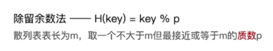
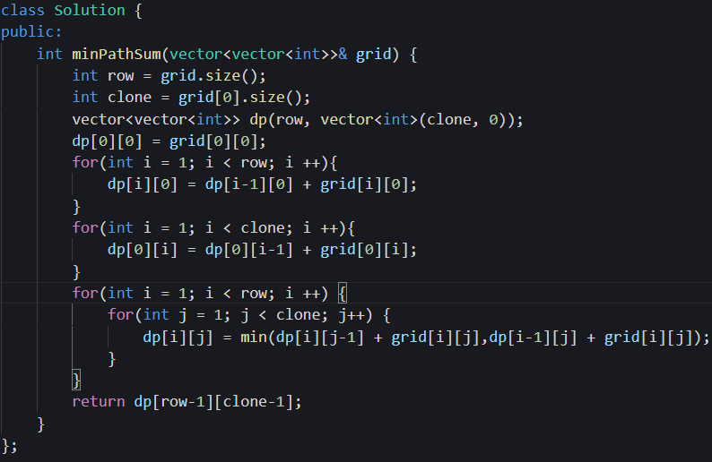

# 学习资料总结

## 计算机网络

视频课程：计算机网络微课堂(湖南大学)

https://www.bilibili.com/video/BV1c4411d7jb?from=search&seid=6668853004177322888&spm_id_from=333.337.0.0

书籍：《网络是怎样连接的》、《图解http》、《计算机网络自顶向下》 进阶《TCP/IP详解》

## 操作系统

视频课程：王道考研的课程：

https://www.bilibili.com/video/BV1YE411D7nH?p=1、

书籍：《现代操作系统》、进阶《深入理解操作系统》里面还包括了计算机组成原理


# STL常用函数使用

## vector 容器


## queue容器适配器


## stack容器适配器


## string容器

- str.substr(i, j)取出在i到j区间内的字符元素。


## priority_queue容器适配器


**注意：priority_queue取出队首元素是使用top，而不是front，这点一定要注意！！**


- 其实**就是一个披着队列外衣的堆**，
  因为优先级队列对外接口只是从队头取元素，从队尾添加元素，再无其他取元素的方式，看起来就是一个队列。
  缺省情况下priority_queue利用**max-heap（大顶堆）**完成对元素的排序，这个**大顶堆是以vector为表现形式的complete binary tree（完全二叉树）**。

- 什么是堆呢？
  **堆是一颗完全二叉树，树中每个结点的值都不小于（或不大于）其左右孩子的值。** 如果父亲结点是大于等于左右孩子就是大顶堆，小于等于左右孩子就是小顶堆。所以大家经常说的大顶堆（堆头是最大元素），小顶堆（堆头是最小元素），如果懒得自己实现的话，就直接用priority_queue（优先级队列）就可以了，底层实现都是一样的，从小到大排就是小顶堆，从大到小排就是大顶堆。
- 优先级队列的cmp函数与排序相反，例如写快排的cmp函数的时候，`return left>right` 就是从大到小，`return left<right` 就是从小到大。
- 传入比较结构体(或者定义一个类），自定义优先级。

```cpp
priority_queue<pair<int, int>, vector<pair<int, int>>, mycomparison> pri_que;
 // 小顶堆
class mycomparison {
    public:
    bool operator()(const pair<int, int>& lhs, const pair<int, int>& rhs) {
        return lhs.second > rhs.second;
    }
};
```

## deque容器


## set-map容器

```cpp
s.empty();
s.size();
s.clear();
s.begin(),s.end();
s.insert(k);
s.erase(k);
s.find(k);
```

# C++11新特性

https://cloud.tencent.com/developer/article/1745592

## auto 和 decltype


一般来说可以在模板类中这么用！！


## 左值与右值


## lambda表达式

https://www.cnblogs.com/DswCnblog/p/5629165.html

C++11的一大亮点就是引入了Lambda表达式。利用Lambda表达式，可以方便的**定义和创建匿名函数**


捕获外部变量常见的方式有：值捕获、引用捕获


## std::move

把一个左值对象变成一个右值

```c++
void TestSTLObject()
{
    std::string str = "Hello";
    std::vector<std::string> v;

    v.push_back(str);
    std::cout << "After copy, str is \"" << str << "\"\n";

    v.push_back(std::move(str));
    std::cout << "After move, str is \"" << str << "\"\n";
    std::cout << "The contents of the vector are \"" << v[0]
                                         << "\", \"" << v[1] << "\"\n";
 
}
//输出
After copy, str is "Hello"
After move, str is "" //这里通过std::move已经讲原来的str变成了一个常量，放入了vector中，所以变成了空的！！！！
The contents of the vector are "Hello", "Hello"
```


## STL 的智能指针

https://blog.csdn.net/cpp_learner/article/details/118912592?spm=1001.2101.3001.6650.2&utm_medium=distribute.pc_relevant.none-task-blog-2%7Edefault%7EOPENSEARCH%7Edefault-2.no_search_link&depth_1-utm_source=distribute.pc_relevant.none-task-blog-2%7Edefault%7EOPENSEARCH%7Edefault-2.no_search_link

### 为什么要使用智能指针

一句话带过：智能指针就是帮我们C++程序员管理动态分配的内存的，它会帮助我们自动释放new出来的内存，从而**避免内存泄漏**！

如下例子就是内存泄露的例子：

```c++
#include <iostream>
#include <string>
#include <memory>
using namespace std;
// 动态分配内存，没有释放就return
void memoryLeak1() {
	string *str = new string("动态分配内存！");
	return;
}
// 动态分配内存，虽然有些释放内存的代码，但是被半路截胡return了
int memoryLeak2() {
	string *str = new string("内存泄露！");
	// ...此处省略一万行代码
	// 发生某些异常，需要结束函数
	if (1) {
		return -1;
	}
	// 另外，使用try、catch结束函数，也会造成内存泄漏！
	delete str;	// 虽然写了释放内存的代码，但是遭到函数中段返回，使得指针没有得到释放
	return 1;
}
int main(void) {
	memoryLeak1();
	memoryLeak2();
	return 0;
} 
```


memoryLeak1函数中，new了一个字符串指针，但是没有delete就已经return结束函数了，导致内存没有被释放，内存泄露！
memoryLeak2函数中，new了一个字符串指针，虽然在函数末尾有些释放内存的代码delete str，但是在delete之前就已经return了，所以内存也没有被释放，内存泄露！

使用指针，我们没有释放，就会造成内存泄露。但是我们使用普通对象却不会！

思考：如果我们分配的动态内存都交由有生命周期的对象来处理，那么在对象过期时，让它的析构函数删除指向的内存，这看似是一个 very nice 的方案？

**智能指针就是通过这个原理来解决指针自动释放的问题！**

### 智能指针起源

很多人谈到c++，说它特别难，可能有一部分就是因为c++的内存管理吧，不像java那样有虚拟机动态的管理内存，在程序运行过程中可能就会出现内存泄漏，然而这种问题其实都可以通过c++11引入的智能指针来解决，相反我还认为这种内存管理还是c++语言的优势，因为尽在掌握。

1. C++98 提供了 **auto_ptr** 模板的解决方案
2. C++11 增加**unique_ptr、shared_ptr 和weak_ptr**

C++11 后auto_ptr 已经被“抛弃”，已使用unique_ptr替代，**auto_ptr 被C++11抛弃的主要原因**

- [ ] 复制或者赋值都会改变资源的所有权


- [ ] 在STL容器中使用auto_ptr存在着重大风险，因为容器内的元素必须支持可复制和可赋值


- [ ] 不支持对象数组的内存管理


所以，C++11用更严谨的unique_ptr 取代了auto_ptr！

### unique_ptr

1. 基于排他所有权模式：两个指针不能指向同一个资源
2. 无法进行左值unique_ptr复制构造，也无法进行左值复制赋值操作，但允许临时右值赋值构造和赋值
3. 保存指向某个对象的指针，当它本身离开作用域时会自动释放它指向的对象。
4. 在容器中保存指针是安全的

**unique_ptr的特性所在**

 A.无法进行左值复制赋值操作，但允许临时右值赋值构造和赋值


B.在 STL 容器中使用unique_ptr，不允许直接赋值（在auto_ptr中可以直接赋值，但是赋值以后后面一个指针就没有了），当然，运行后是直接报错的，因为vec[1]已经是NULL了，再继续访问就越界了。


C.支持对象数组的内存管理


除了上面ABC三项外，unique_ptr的其余用法都与auto_ptr用法一致。

**常见的几种操作：**

1.构造


2.赋值，必须使用std::move来讲对象变为右值


3.主动释放对象


4.放弃对象的控制权


5.重置，就是把原来的智能指针指向的内存给分解了，然后重新托管一个参数指针。


**auto_ptr 与 unique_ptr智能指针的内存管理陷阱**


这是由于auto_ptr 与 unique_ptr的排他性所导致的！
**为了解决这样的问题，我们可以使用shared_ptr指针指针！**

### shared_ptr

熟悉了unique_ptr 后，其实我们发现unique_ptr 这种排他型的内存管理并不能适应所有情况，有很大的局限！如果需要多个指针变量共享怎么办？如果有一种方式，可以记录引用特定内存对象的智能指针数量，当复制或拷贝时，引用计数加1，当智能指针析构时，引用计数减1，如果计数为零，代表已经没有指针指向这块内存，那么我们就释放它！这就是 shared_ptr 采用的策略！

1.引用计数的使用，调用**use_count**函数可以获得当前托管指针的引用计数。


如上代码，sp1 = sp2; 和 shared_ptr< Person > sp3(sp1);就是在使用引用计数了。


2.构造


3.初始化

- 方式一：构造函数


- 方式二：使用make_shared 初始化对象，分配内存效率更高**(推荐使用)**
  make_shared函数的主要功能是在动态内存中分配一个对象并初始化它，返回指向此对象的shared_ptr; 用法：
  make_shared<类型>(构造类型对象需要的参数列表);


4.赋值


5.主动释放对象


6.重置
p.reset() ; 将p重置为空指针，所管理对象引用计数 减1
p.reset(p1); 将p重置为p1（的值）,p 管控的对象计数减1，p接管对p1指针的管控
p.reset(p1,d); 将p重置为p1（的值），p 管控的对象计数减1并使用d作为删除器
p1是一个指针！

**ared_ptr使用陷阱**

shared_ptr作为被管控的对象的成员时，小心因循环引用造成无法释放资源!

如下代码：
Boy类中有Girl的智能指针；
Girl类中有Boy的智能指针；


useTrap函数结束后，函数中定义的智能指针被清掉，boy和girl指针的引用计数减1，还剩下1，对象中的智能指针还是托管他们的，所以函数结束后没有将boy和gilr指针释放的原因就是于此。

**所以在使用shared_ptr智能指针时，要注意避免对象交叉使用智能指针的情况！** 否则会导致内存泄露！当然，这也是有办法解决的，那就是使用**weak_ptr**弱指针。

### weak_ptr

weak_ptr 设计的目的是为配合 shared_ptr 而引入的一种智能指针来**协助 shared_ptr 工作**, 它只可以从一个 shared_ptr 或另一个 weak_ptr 对象构造, 它的构造和析构不会引起引用记数的增加或减少。 同时weak_ptr 没有重载*和->但可以使用 lock 获得一个可用的 shared_ptr 对象。

1.弱指针的使用；
weak_ptr wpGirl_1; // 定义空的弱指针
weak_ptr wpGirl_2(spGirl); // 使用共享指针构造
wpGirl_1 = spGirl; // 允许共享指针赋值给弱指针

2.弱指针也可以获得引用计数；
wpGirl_1.use_count()

3.弱指针不支持 * 和 -> 对指针的访问；


### 智能指针的陷阱

1. 不要把一个原生指针给多个智能指针管理;

   ```c++
   int *x = new int(10);
   unique_ptr< int > up1(x);
   unique_ptr< int > up2(x);
   ```

   // 警告! 以上代码使up1 up2指向同一个内存,非常危险
   或以下形式：

   ```c++
   up1.reset(x);
   up2.reset(x);
   ```

   

2. 记得使用u.release()的返回值;
   在调用u.release()时是不会释放u所指的内存的，这时返回值就是对这块内存的唯一索引，如果没有使用这个返回值释放内存或是保存起来，这块内存就泄漏了.

3. 禁止delete 智能指针get 函数返回的指针;
   如果我们主动释放掉get 函数获得的指针，那么智能 指针内部的指针就变成野指针了，析构时造成重复释放，带来严重后果!

4. 禁止用任何类型智能指针get 函数返回的指针去初始化另外一个智能指针！

   ```c++
   shared_ptr< int > sp1(new int(10));
   // 一个典型的错误用法 shared_ptr< int > sp4(sp1.get());
   ```

## 基于范围的for循环

```c++
vector<int> vec;
for (auto iter = vec.begin(); iter != vec.end(); iter++) { // before c++11
   cout << *iter << endl;
}
for (int i : vec) { // c++11基于范围的for循环
cout << "i" << endl;
}
```

## nullptr（c++新的空指针代替了原来的NULL)

nullptr是c++11用来表示空指针新引入的常量值，在c++中如果表示空指针语义时建议使用nullptr而不要使用NULL，因为NULL本质上是个int型的0，其实不是个指针。举例：

```C++
void func(void *ptr) {
   cout << "func ptr" << endl;
}
void func(int i) {
   cout << "func i" << endl;
}
int main() {
   func(NULL); // 编译失败，会产生二义性
   func(nullptr); // 输出func ptr
   return 0;
}
```

## final & override

c++11关于继承新增了两个关键字，final用于修饰一个类，表示禁止该类进一步派生和虚函数的进一步重载，override用于修饰派生类中的成员函数，标明该函数重写了基类函数，如果一个函数声明了override但父类却没有这个虚函数，编译报错，使用override关键字可以避免开发者在重写基类函数时无意产生的错误。

```C++
struct Base {
   virtual void func() {
       cout << "base" << endl;
  }
};
struct Derived : public Base{
   void func() override { // 确保func被重写
       cout << "derived" << endl;
  }
   void fu() override { // error，基类没有fu()，不可以被重写
  }
};
```

```C++
struct Base final {
   virtual void func() {
       cout << "base" << endl;
  }
};
struct Derived : public Base{ // 编译失败，final修饰的类不可以被继承
   void func() override {
       cout << "derived" << endl;
  }
};
```

## default

c++11引入default特性，多数时候用于声明构造函数为默认构造函数，如果类中有了自定义的构造函数，编译器就不会隐式生成默认构造函数，如下代码：

```C++
struct A {
   int a;
   A(int i) { a = i; }
};
int main() {
   A a; // 编译出错
   return 0;
}

struct A {
   A() = default;
   int a;
   A(int i) { a = i; }
};
int main() {
   A a;// 编译通过
   return 0;
}
```

## delete

c++中，如果开发人员没有定义特殊成员函数，那么编译器在需要特殊成员函数时候会隐式自动生成一个默认的特殊成员函数，例如拷贝构造函数或者拷贝赋值操作符，如下代码：

```c++
struct A {
   A() = default;
   A(const A&) = delete;
   A& operator=(const A&) = delete;
   int a;
   A(int i) { a = i; }
};
int main() {
   A a1;
   A a2 = a1;  // 错误，拷贝构造函数被禁用
   A a3;
   a3 = a1;  // 错误，拷贝赋值操作符被禁用
}
```

## constexpr

constexpr是c++11新引入的关键字，用于编译时的常量和常量函数，这里直接介绍constexpr和const的区别：

两者都代表可读，const只表示read only的语义，只保证了运行时不可以被修改，但它修饰的仍然有可能是个动态变量，而constexpr修饰的才是真正的常量，它会在编译期间就会被计算出来，整个运行过程中都不可以被改变，constexpr可以用于修饰函数，这个函数的返回值会尽可能在编译期间被计算出来当作一个常量，但是如果编译期间此函数不能被计算出来，那它就会当作一个普通函数被处理。

```c++
#include<iostream>
using namespace std;

constexpr int func(int i) {
   return i + 1;
}

int main() {
   int i = 2;
   func(i);// 普通函数
   func(2);// 编译期间就会被计算出来
}
```

## enum class

c++11新增有作用域的枚举类型，看代码

不带作用域的枚举代码

```c++
enum AColor {
   kRed,
   kGreen,
   kBlue
};
enum BColor {
   kWhite,
   kBlack,
   kYellow
};
int main() {
   if (kRed == kWhite) {
       cout << "red == white" << endl;
  }
   return 0;
}
```

如上代码，不带作用域的枚举类型可以自动转换成整形，且不同的枚举可以相互比较，代码中的红色居然可以和白色比较，这都是潜在的难以调试的bug，而这种完全可以通过有作用域的枚举来规避。

有作用域的枚举代码：

```c++
enum class AColor {
   kRed,
   kGreen,
   kBlue
};
enum class BColor {
   kWhite,
   kBlack,
   kYellow
};
int main() {
   if (AColor::kRed == BColor::kWhite) { // 编译失败
       cout << "red == white" << endl;
  }
   return 0;
}
```

# 数据结构

## 图论

### 广度优先遍历(BFS)


1.同一个图的邻接矩阵表示唯一，所以广度优先遍历序列**唯一**

2.同一个图的邻接表表示不唯一，所以广度优先遍历序列**不唯一**


由于对于非联通图，前面的代码只能保证遍历完一个图，所以又引入了一个**额外的for循环来进行遍历两个图中所有的顶点**


时间复杂度的分析


生成树是通过对于节点的遍历顺序来确定的。


有向图必须用final版的BFS


### 深度优先遍历(DFS)


### 最小生成树(prim,kruskal)


krukal中使用了并查集合的概念，主要流程就是每次选择两个边，并且判断两个边是否连通，也就是两个顶点是否属于同一个集合。


### 最短路径问题(bfs,djkstra,floyd)


1. BFS算法：不带权值的最短路径，其实就是使用改造以后的BFS算法，这里需要定义两个数组，**一个记录权重，一个记录最短路径的来源。**


2.djkstra算法：只能计算**权值为正**的最短路径，prim算法和djkstra算法其实有类似，即代价数据和最短路径数组其实是一回事。


3.floyd算法


### 有向无环图(DAG,拓扑排序)


## 哈希表(hash table)

### 哈希表


### 哈希冲突

  


### 哈希函数

为了保证关键词尽可能的分布在不同的区间中，也就是通过哈希函数的映射以后，关键词尽可能的不发生哈希冲突（碰撞）。我们需要考虑设计不同的哈希函数来进行处理。常见的哈希函数有：



## 排序算法

### 算法的稳定性


### 插入排序


### 希尔排序


### 快速排序


### 堆排序(选择排序的一种)


### 堆的插入与删除


### 归并排序


### 基数排序


# LeedCode

## 常用函数

- int->sting: to_string(1)

## 数组


### 滑动窗口

滑动窗口一般情况下需要在一个while循环中进行，不断的动态调整窗口的起始位置。终止位置一般是通过一个全局循环来控制。


这种题一般使用字典+双指针+滑动窗口来实现


## 链表

移除链表元素，设置虚拟头节点的基本操作


翻转链表的递归操作**(这里还是比较难理解的)**


删除元素，记得需要定义一个虚拟节点，不然如果只有一个节点的时候，head->next = hexd->next->next是没有意义的


## 双指针法

### 三树之和


## 栈与队列

1. C++中stack 是容器么？
   栈是以底层容器完成其所有的工作，对外提供统一的接口，底层容器是可插拔的（也就是说我们可以控制使用哪种容器来实现栈的功能）。**所以STL中栈往往不被归类为容器，而被归类为container adapter（容器适配器）**。

2. 我们使用的STL中stack是如何实现的？

   我们常用的SGI STL，如果没有指定底层实现的话，**默认是以deque**为缺省情况下栈的低层结构。

   deque是一个双向队列，只要封住一段，只开通另一端就可以实现栈的逻辑了。

   SGI STL中 队列底层实现缺省情况下一样使用deque实现的

   我们也可以**指定vector为栈**的底层实现，初始化语句如下：

   ```c++
   std::stack<int, std::vector<int> > third;  // 使用vector为底层容器的栈
   std::queue<int, std::list<int>> third; // 定义以list为底层容器的队列
   ```

3. stack 提供迭代器来遍历stack空间么？

   栈提供push 和 pop 等等接口，所有元素必须符合先进后出规则，**所以栈不提供走访功能，也不提供迭代器(iterator)**。 不像是set 或者map 提供迭代器iterator来遍历所有元素。

### 用栈实现队列

```cpp
class MyQueue {
public:
    stack<int> stIn;
    stack<int> stOut;
    MyQueue() {
    }
    void push(int x) {
        stIn.push(x);
    }
    int pop() {
        // 只有当stOut为空的时候，再从stIn里导入数据（导入stIn全部数据）
        if (stOut.empty()) {
            // 从stIn导入数据直到stIn为空
            while(!stIn.empty()) {
                stOut.push(stIn.top());
                stIn.pop();
            }
        }
        int result = stOut.top();
        stOut.pop();
        return result;
    }
    int peek() {
        int res = this->pop(); // 直接使用已有的pop函数
        stOut.push(res); // 因为pop函数弹出了元素res，所以再添加回去
        return res;
    }
    bool empty() {
        return stIn.empty() && stOut.empty();
    }
};
```

### 用队列实现栈

```cpp
class MyStack {
public:
    queue<int> que1;
    queue<int> que2; // 辅助队列，用来备份
    MyStack() {

    }
    void push(int x) {
        que1.push(x);
    }
    int pop() {
        int size = que1.size();
        size--;
        while (size--) { // 将que1 导入que2，但要留下最后一个元素
            que2.push(que1.front());
            que1.pop();
        }
        int result = que1.front(); // 留下的最后一个元素就是要返回的值
        que1.pop();
        que1 = que2;            // 再将que2赋值给que1
        while (!que2.empty()) { // 清空que2
            que2.pop();
        }
        return result;
    }
    int top() {
        return que1.back();
    }
    bool empty() {
        return que1.empty();
    }
};
```

### 滑动窗口最大值-最小值


- 滑动窗口最大值：

  必须使用一种**从大到小**的双向队列，每次都取队列的front；

  pop()每次**判断是否和front相同**，如果相同说明此时的队列size已经和窗口大小相同了，就删除；

  push()每次都必须保证队列的**back处于最小的**

- 滑动窗口最小值：

  必须使用一种**从小到大**的双向队列，每次都取队列的front；

  pop()每次**判断是否和front相同**，如果相同说明此时的队列size已经和窗口大小相同了，就删除；

  push()每次都必须保证队列的**back处于最大的**

  ```c++
  class Solution {
  private:
      class MyQueue { //单调队列（从大到小）
      public:
          deque<int> que; // 使用deque来实现单调队列
          void pop(int value) {
              if (!que.empty() && value == que.front()) {
                  que.pop_front();
              }
          }
          void push(int value) {
              while (!que.empty() && value > que.back()) {//维持滑动窗口最大值 value < que.back() 维持滑动窗口最小值
                  que.pop_back();
              }
              que.push_back(value);
          }
          int front() {
              return que.front();
          }
          int back() {
              return que.back();
          }
      };
  public:
      vector<int> maxSlidingWindow(vector<int>& nums, int k) {
          MyQueue que;
          vector<int> result;
          for (int i = 0; i < k; i++) { // 先将前k的元素放进队列
              que.push(nums[i]);
          }
          result.push_back(que.front()); // result 记录前k的元素的最大值
          for (int i = k; i < nums.size(); i++) {
              que.pop(nums[i - k]); // 滑动窗口移除最前面元素
              que.push(nums[i]); // 滑动窗口前加入最后面的元素
              result.push_back(que.front()); // 记录对应的最大值
          }
          return result;
      }
  };
  ```

## 二叉树


### 二叉树的种类

**满二叉树：**如果一棵二叉树只有度为0的结点和度为2的结点，并且度为0的结点在同一层上，则这棵二叉树为满二叉树。


**完全二叉树**：在完全二叉树中，除了最底层节点可能没填满外，其余每层节点数都达到最大值，并且最下面一层的节点都集中在该层最左边的若干位置。若最底层为第 h 层，则该层包含 1~ 2^h -1  个节点。


**二叉搜索树**：前面介绍的树，都没有数值的，而二叉搜索树是有数值的了，**二叉搜索树是一个有序树**。

- 若它的左子树不空，则左子树上所有结点的值均小于它的根结点的值；
- 若它的右子树不空，则右子树上所有结点的值均大于它的根结点的值；
- 它的左、右子树也分别为二叉排序树


**平衡二叉搜索树**：又被称为AVL（Adelson-Velsky and Landis）树，且具有以下性质：它是一棵空树或它的左右两个子树的高度差的绝对值不超过1，并且左右两个子树都是一棵平衡二叉树。

**C++中map、set、multimap，multiset的底层实现都是平衡二叉搜索树**，所以map、set的增删操作时间时间复杂度是logn，注意我这里没有说unordered_map、unordered_set，unordered_map、unordered_map底层实现是**哈希表**


**二叉树的遍历方式**

- 深度优先遍历
  - 前序遍历（递归法，迭代法）
  - 中序遍历（递归法，迭代法）
  - 后序遍历（递归法，迭代法）
- 广度优先遍历
  - 层次遍历（迭代法

```c++
struct TreeNode {
    int val;
    TreeNode *left;
    TreeNode *right;
    TreeNode(int x) : val(x), left(NULL), right(NULL) {}
};
```

### 二叉树的递归遍历

前序遍历：


中序遍历：


后序遍历：


### 二叉树的迭代遍历

前序遍历：


中序遍历：


后序遍历：


### 二叉树的统一迭代遍历

```cpp
class Solution {
public:
    vector<int> inorderTraversal(TreeNode* root) {
        vector<int> result;
        stack<TreeNode*> st;
        if (root != NULL) st.push(root);
        while (!st.empty()) {
            TreeNode* node = st.top();
            if (node != NULL) {
                st.pop(); // 将该节点弹出，避免重复操作，下面再将右中左节点添加到栈中
                
                //中序遍历
                //if (node->right) st.push(node->right);  // 右
                //st.push(node);                          // 中
                //st.push(NULL); // 中节点访问过，但是还没有处理，加入空节点做为标记。
                //if (node->left) st.push(node->left);    // 左
                
                //前序遍历
                
                //if (node->right) st.push(node->right);  // 右
                //if (node->left) st.push(node->left);    // 左
                //st.push(node);                          // 中
                //st.push(NULL);
                
                //后续遍历
                //st.push(node);                          // 中
                //if (node->right) st.push(node->right);  // 右
                //if (node->left) st.push(node->left);    // 左
                
            } else { // 只有遇到空节点的时候，才将下一个节点放进结果集
                st.pop();           // 将空节点弹出
                node = st.top();    // 重新取出栈中元素
                st.pop();
                result.push_back(node->val); // 加入到结果集
            }
        }
        return result;
    }
};
```

### 对称二叉树


### 二叉树的最大深度

后续遍历


前序遍历


层次遍历


### 二叉树的最小深度


递归版本，和最大深度不同。（**计算的深度必须是叶子节点，与就是如果这个节点只要存在左右孩子，就得考虑**）

**不能使用前序遍历**，因为前序遍历记录的最小深度肯定就是1了！！！


层次遍历


### 判断平衡二叉树


### 二叉树的所有路径


二叉树的路径总和II


### 左叶子之和

定义什么是左叶子，父节点的左孩子不为空，并且左孩子没有自己的任何孩子。

**所有的递归，迭代算法都是可以的！**


### 遍历序列构造二叉树

从中序与后序


从前序与中序(类似的)


### 二叉搜索树中的搜索


### 验证二插搜索树


递归法


迭代法


### 二叉搜索树的最小绝对差


### 二叉树的公共祖先

必须从底向上进行搜索


### 二叉搜索树的公共祖先

只需要从上往下遍历，遇到一个节点处于[p,q]区间就结束。


### 二叉搜索树的插入操作


### 二叉搜索树的删除操作


###  修剪二叉搜索树


## 回溯法


- 组合问题：N个数里面按一定规则找出k个数的集合
- 切割问题：一个字符串按一定规则有几种切割方式
- 子集问题：一个N个数的集合里有多少符合条件的子集
- 排列问题：N个数按一定规则全排列，有几种排列方式
- 棋盘问题：N皇后，解数独等等

### 组合问题


**组合问题II （需要考虑去重）**

使用used数组去重


使用set进行去重，

set去重比较简单，就是同一层找到相同的元素就不考虑

纵向递归的时候由于**每次都是重新定义了一个set所以可以考虑重复的元素**


### 电话号码的组合


### 子集


### 排列问题

这里使用unorded_se去重的时候和其他的有所不同，定义全局的变量

判断是否在递归前出现过


使用used进行去重


使用set进行去重


使用used去重


使用set，和used一起进行去重


重新安排行程


### N皇后


### 解数独


### 括号生成

这个题用回溯给我人写麻了！！！


## 贪心算法

### 摆动序列


### 加油站


### 分发糖果


### 根据身高重新排序


### 用最少数量的箭引爆气球

锁定右区间！，**在排序的时候一定要加引用&不然就会超时！！**


### 无重叠区间

这个题最少数量引爆气球的题其实是类似的，锁定右区间就好


### 合并区间

必须从左边界进行排序


### 划分字母区间

这个需要首先记录一般每个字母出现的最远位置


### 单调递增的数字

- 转换为字符以后进行操作
- 第一遍**只记录开始不符合要求的数字出现的位置**，后面将这个位置以后的全部覆盖为9就好


## 动态规划


### 基础问题

- 爬楼梯，**dp[i] = dp[i-1] + dp[i-2]**

- 爬楼梯花费的最小代价：**dp[i] = min(dp[i - 1], dp[i - 2]) + cost[i];**

- 不同路径：

  - **dp\[i][j] = dp\[i - 1][j] + dp\[i][j - 1]**
  - 初始化，**dp\[i][0] = 1，dp\[0][j] = 1**

- 不同路径II:

  - 递归函数

    ```c++
    if (obstacleGrid[i][j] == 1) continue;
            dp[i][j] = dp[i - 1][j] + dp[i][j - 1];
    ```

  - 初始化dp数组

    ```cpp
    for (int i = 0; i < m && obstacleGrid[i][0] == 0; i++) dp[i][0] = 1;
    for (int j = 0; j < n && obstacleGrid[0][j] == 0; j++) dp[0][j] = 1;
    ```

- 整数拆分：
  - 遍历i之前的数据j，每次相当于**拆分2个(i - j) * j,** 或**3个以上dp[i - j] * j**
  - **dp[i] = max(dp[i], max((i - j) * j, dp[i - j] * j));**
- 不同的二插搜索树
  - 其实就是dp[i]代表二叉树的总共结构个数，其实就可以拆分为总共有i-1个节点的两个左右子树的不同组合
  - 比如**顶部就是第i个节点：(左2，右0)  (左1，右1)  (左0，右2）**


### 背包问题


#### 01背包

- 01背包二维：

  - 递推公式：**dp\[i][j] = max(dp\[i - 1][j], dp\[i - 1][j - weight[i]] + value[i]);**

  - 初始化： 需要使用**dp\[0][j]**

    ```c++
    vector<int> weight = {1, 3, 4};
    vector<int> value = {15, 20, 30};
    int bagWeight = 4;
    // 二维数组
    vector<vector<int>> dp(weight.size(), vector<int>(bagWeight + 1, 0));
    for (int j = weight[0]; j <= bagWeight; j++) {
        dp[0][j] = value[0];
    }
    ```

- 01背包1维：

  - 递推公式：**dp[j] = max(dp[j], dp[j - weight[i]] + value[i]);**

  - 初始化就全部是0就ok

  - 倒叙遍历背包容量，防止一个物品被装多次

  - ```c++
    for(int i = 0; i < weight.size(); i++) { // 遍历物品
        for(int j = bagWeight; j >= weight[i]; j--) { // 遍历背包容量
            dp[j] = max(dp[j], dp[j - weight[i]] + value[i]);
    
        }
    }
    ```

1. **分割等和子集：**给定一个只包含正整数的非空数组。是否可以将这个数组分割成两个子集，使得两个子集的元素和相等
   思路：将数据容量的一半当做背包容量就行，纯粹转换为01背包问题
2. **最后一块石头的重量 II**：一堆石头互相碰撞粉碎，最后最多只剩下一个石头，求最小的重量。
   思路：还是把所有石头重量求和，除以一半，当成背包容量，装的越满则粉碎的越多。
3. **目标和：**给定一个非负整数数组，a1, a2, ..., an, 和一个目标数，S。现在你有两个符号 + 和 -。对于数组中的任意一个整数，你都可以从 + 或 -中选择一个符号添加在前面。
   思路：s1+s2 = sum, s1-s2 = s,所以需要装满的背包的容量就是**s1 = (sum + s)/2**，**（要求必须装满）***
   递推公式：**dp[j] += dp[j - nums[i]]**
4. **一和零**：给你一个二进制字符串数组 strs 和两个整数 m 和 n 。请你找出并返回 strs 的最大子集的大小，该子集中 最多 有 m 个 0 和 n 个 1 。
   示例 1：输入：strs = ["10", "0001", "111001", "1", "0"], m = 5, n = 3 输出：4
   思路：二维背包容量，然后计算总共尽可能填满的组合个数**（不同与前面的，这里不要求装满）**
   递推公式：**dp\[i][j] = max(dp\[i][j], dp\[i - zeroNum][j - oneNum] + 1);**

#### 完全背包

- 完全背包
  - 小到大去遍历，物品可以添加多次
  - for循环嵌套顺序无所谓
  - 遍历顺序，**组合数**背包容量在内循环，**排列数**背包容量在外循环，原因主要就是物品放外循环则访问的顺序的固定的

1. **零钱兑换II：**给定不同面额的硬币和一个总金额。写出函数来计算可以凑成总金额的硬币组合数。假设每一种面额的硬币有无限个。
   示例 1:输入: amount = 5, coins = [1, 2, 5] 输出: 4 解释: 有四种方式可以凑成总金额: 5=5 5=2+2+1 5=2+1+1+1 5=1+1+1+1+1
   思路：就是重复可以用的求组合**（要求必须装满）**
   递推公式：**dp[j] += dp[j - nums[i]]**
   遍历顺序：因为求的组合数，所以**背包容量必须放在内循环！**

2. **组合总和IV:**  给定一个由正整数组成且不存在重复数字的数组，找出和为给定目标正整数的组合的个数。
   示例:nums = [1, 2, 3] target = 4，所有可能的组合为： (1, 1, 1, 1) (1, 1, 2) (1, 2, 1) (1, 3) (2, 1, 1) (2, 2) (3, 1)
   遍历顺序：因为求的排列数，所以**背包容量必须放在外循环！**

3. **爬楼梯进阶版**：就是求到楼顶的所有方法，就是求排列数，**dp[j] += dp[j - nums[i]]（要求必须装满）**

4. **零钱兑换**：给定不同面额的硬币 coins 和一个总金额 amount。编写一个函数来计算可以凑成总金额所需的最少的硬币个数。如果没有任何一种硬币组合能组成总金额，返回 -1。你可以认为每种硬币的数量是无限的。示例 1： 输入：coins = [1, 2, 5], amount = 11 输出：3 解释：11 = 5 + 5 + 1
   思路：可以重复选取，并且求最小个数，而不是组合数
   遍历顺序：**求最小个数遍历顺序无所谓！**
   递归公式：**dp[j] = min(dp[j - coins[i]] + 1, dp[j]);**   if (dp[j - coins[i]] != INT_MAX) { // dp[j - coins[i]] + 1会越界！！
   初始化: 初始化设置为最大值，**dp[j - coins[i]] + 1会越界！！**

5. **完全平方数：**给定正整数 n，找到若干个完全平方数（比如 1, 4, 9, 16, ...）使得它们的和等于 n。你需要让组成和的完全平方数的个数最少。
   示例 1： 输入：n = 12 输出：3 解释：12 = 4 + 4 + 4
   思路：**与零钱兑换一模一样**

6. **单词拆分：**给定一个非空字符串 s 和一个包含非空单词的列表 wordDict，判定 s 是否可以被空格拆分为一个或多个在字典中出现的单词。
   示例 1： 输入: s = "leetcode", wordDict = ["leet", "code"] 输出: true 解释: 返回 true 因为 "leetcode" 可以被拆分成 "leet code"。
   思路：这里的物品其实是dp[i]字符之前的i-1字母，这样就可以构成一个子区间然后和worddict进行判断

   ```cpp
   class Solution {
   public:
       bool wordBreak(string s, vector<string>& wordDict) {
           unordered_set<string> wordSet(wordDict.begin(), wordDict.end());
           vector<bool> dp(s.size() + 1, false);
           dp[0] = true;
           for (int i = 1; i <= s.size(); i++) {   // 遍历背包
               for (int j = 0; j < i; j++) {       // 遍历物品
                   string word = s.substr(j, i - j); //substr(起始位置，截取的个数)
                   if (wordSet.find(word) != wordSet.end() && dp[j]) {
                       dp[i] = true;
                   }
               }
           }
           return dp[s.size()];
       }
   };
   ```

#### 多重背包

其实就是01背包多加了一层循环。

```cpp
for(int i = 0; i < weight.size(); i++) { // 遍历物品
        for(int j = bagWeight; j >= weight[i]; j--) { // 遍历背包容量
            // 以上为01背包，然后加一个遍历个数
            for (int k = 1; k <= nums[i] && (j - k * weight[i]) >= 0; k++) { // 遍历个数
                dp[j] = max(dp[j], dp[j - k * weight[i]] + k * value[i]);
            }
        }
}
```

### 打家劫舍

1. **打家劫舍I:** 一排房屋只能间隔一个进行盗窃示例 1： 输入：[1,2,3,1] ，偷窃到的最高金额 = 1 + 3 = 4 
   递归公式：**dp[i] = max(dp[i - 2] + nums[i], dp[i - 1]);**

2. **打家劫舍II**：所有的房屋都 围成一圈 ，这意味着第一个房屋和最后一个房屋是紧挨着的
   思路：就是分成两种情况，分别使用动态规划，不考虑第一个房屋或者不考虑最后一个房屋

3. **打家劫舍III**：地方的所有房屋的排列类似于一棵二叉树
   思路：树型dp的经典题目，遍历二叉树**必须使用后续遍历**，因为要利用左右孩子的返回值

   ```cpp
   class Solution {
   public:
       int rob(TreeNode* root) {
           vector<int> result = robTree(root);
           return max(result[0], result[1]);
       }
       // 长度为2的数组，0：不偷，1：偷
       vector<int> robTree(TreeNode* cur) {
           if (cur == NULL) return vector<int>{0, 0};
           vector<int> left = robTree(cur->left);
           vector<int> right = robTree(cur->right);
           // 偷cur
           int val1 = cur->val + left[0] + right[0];
           // 不偷cur
           int val2 = max(left[0], left[1]) + max(right[0], right[1]);
           return {val2, val1};
       }
   };
   ```

### 买卖股票的最佳时间

1. **买卖股票的最佳时间**：只能买一次
   递推公式：持有股票 **dp\[i][0] = max(dp\[i - 1][0], -prices[i])**，不持有股票 **dp\[i][1] = max(dp\[i - 1][1], prices[i] + dp\[i - 1][0])**

2. **买卖股票的最佳时间**II：可以买多次
   递推公式：**(唯一不同的地方)** 持有股票 **dp\[i][0] = max(dp\[i - 1][0], dp\[i - 1][1]-prices[i])**，不持有股票 **dp\[i][1] = max(dp\[i - 1][1], prices[i] + dp\[i - 1][0])**

3. **买卖股票含有手续费：**
   递推公式：持有股票 **dp\[i][0] = max(dp\[i - 1][0], dp\[i - 1][1]-prices[i])**，**(唯一不同的地方)**  不持有股票 **dp\[i][1] = max(dp\[i - 1][1], prices[i] + dp\[i - 1][0]) - fee**

4. **买卖股票的最佳时间**II：只能买2次
   递推公式：五个状态，(**没操作，第一天买入，第一天卖出，第二天买入，第二天卖出**)

   ```c++
   dp[0][1] = -prices[0];
   dp[0][3] = -prices[0];
   for (int i = 1; i < prices.size(); i++) {
       dp[i][0] = dp[i - 1][0];
       dp[i][1] = max(dp[i - 1][1], dp[i - 1][0] - prices[i]);
       dp[i][2] = max(dp[i - 1][2], dp[i - 1][1] + prices[i]);
       dp[i][3] = max(dp[i - 1][3], dp[i - 1][2] - prices[i]);
       dp[i][4] = max(dp[i - 1][4], dp[i - 1][3] + prices[i]);
   }
   ```

5. **买卖股票的最佳时间**IV：只能买k次

   ```c++
   for (int j = 1; j < 2 * k; j += 2) {
       dp[0][j] = -prices[0];
   }
   for (int i = 1;i < prices.size(); i++) {
       for (int j = 0; j < 2 * k - 1; j += 2) {
           dp[i][j + 1] = max(dp[i - 1][j + 1], dp[i - 1][j] - prices[i]);
           dp[i][j + 2] = max(dp[i - 1][j + 2], dp[i - 1][j + 1] + prices[i]);
       }
   }
   ```

6. **买卖股票的有冷冻期：**四种状态，**(持有股票，卖出股票超过2天，昨天买入今天卖出股票，冷冻期即卖出股票1天)**

   ```c++
   dp[0][0] -= prices[0]; // 持股票
   for (int i = 1; i < n; i++) {
       dp[i][0] = max(dp[i - 1][0], max(dp[i - 1][3], dp[i - 1][1]) - prices[i]);
       dp[i][1] = max(dp[i - 1][1], dp[i - 1][3]);
       dp[i][2] = dp[i - 1][0] + prices[i];
       dp[i][3] = dp[i - 1][2];
   }
   ```

### 子序列问题

#### 子序列不连续

**一般是取max记录不连续的个数**

1. **最长递增子序列：**给你一个整数数组 nums ，找到其中最长严格递增子序列的长度。示例 1： 输入：nums = [10,9,2,5,3,7,101,18] 输出：4 解释：最长递增子序列是 [2,3,7,101]
   思路：位置i的最长升序子序列等于j从0到i-1各个位置的最长升序子序列 + 1 的最大值。所以：**if (nums[i] > nums[j]) dp[i] = max(dp[i], dp[j] + 1);**

2. **最长公共子序列：**输入：text1 = "abcde", text2 = "ace"输出：3解释：最长公共子序列是 "ace"

   思路：两种情况，(**前一个字符匹配，前一个字符不匹配（可能是text1，或text2）**)

   初始化：**(为了方便代码执行)** dp\[i][j]：长度为[0, i - 1]的字符串text1与长度为[0, j - 1]的字符串text2的最长公共子序列

   ```c++
   for (int i = 1; i <= text1.size(); i++) {
               for (int j = 1; j <= text2.size(); j++) {
                   if (text1[i - 1] == text2[j - 1]) {
                       dp[i][j] = dp[i - 1][j - 1] + 1;
                   } else {
                       dp[i][j] = max(dp[i - 1][j], dp[i][j - 1]);
                   }
               }
           }
   ```

3. **不相交的线：**就是两个数组连接相同的线，返回最大的连接数！与上题一模一样

#### 子序列连续

**一般定义一个result，来不断更新记录连续的个数**

1. **最长连续递增子序列：****dp[i + 1] = dp[i] + 1**

2. **最长重复子数组：**输入： A: [1,2,3,2,1] B: [3,2,1,4,7] 输出：3 解释： 长度最长的公共子数组是 [3, 2, 1] 。

   ```c++
   for (int i = 1; i <= A.size(); i++) {
       for (int j = 1; j <= B.size(); j++) {
           if (A[i - 1] == B[j - 1]) {
               dp[i][j] = dp[i - 1][j - 1] + 1;
           }
           if (dp[i][j] > result) result = dp[i][j];
       }
   }
   ```

3. **最大连续子序列的和：**要么从头开始记录，要么从上一时刻开始记录

   ```cpp
   dp[i] = max(dp[i - 1] + nums[i], nums[i]); // 状态转移公式
   if (dp[i] > result) result = dp[i]; // result 保存dp[i]的最大值
   ```

4. **乘积最大的连续数组：**由于负数的存在，所以分开讨论，**dp\[i][0]和dp\[i][1]分布表示乘积以后的最大正值和最小负值。**


### 编辑距离

1. **判断子序列：**给定字符串 s 和 t ，判断 s 是否为 t 的子序列。示例 1： 输入：s = "abc", t = "ahbgdc" 输出：true
   思路：其实就是和求**非连续的最长公共子序列是一样的**
   递归公式：if (s[i - 1] == t[j - 1])，那么**dp\[i][j] = dp\[i - 1][j - 1] + 1**; else dp\[i][j] = **max(dp\[i][j - 1], dp\[i-1][j])或者dp\[i][j] = dp\[i][j - 1]**
   
2. **不同的子序列：**定一个字符串 s 和一个字符串 t ，计算在 s 的子序列中 t 出现的个数。例子：rabbit 在 rabbbit中出现的次数 
   思路： dp\[i][j]：以i-1为结尾的s子序列中出现以j-1为结尾的t的个数为dp\[i][j]
   递归公式：一部分是用s[i - 1]来匹配，那么个数为dp\[i - 1][j - 1]。一部分是不用s[i - 1]来匹配，个数为dp\[i - 1][j]。

   ```c++
   for (int i = 1; i <= s.size(); i++) {
       for (int j = 1; j <= t.size(); j++) {
           if (s[i - 1] == t[j - 1]) {
               dp[i][j] = dp[i - 1][j - 1] + dp[i - 1][j];
           } else {
               dp[i][j] = dp[i - 1][j];
           }
       }
   }
   ```

3. **两个字符串的删除操作：**给定两个单词 word1 和 word2，找到使得 word1 和 word2 相同所需的最小步数，每步可以删除任意一个字符串中的一个字符。

   示例：输入: "sea", "eat"输出: 2 解释: 第一步将"sea"变为"ea"，第二步将"eat"变为"ea"

   ```c++
   for (int i = 0; i <= word1.size(); i++) dp[i][0] = i;
           for (int j = 0; j <= word2.size(); j++) dp[0][j] = j;
           for (int i = 1; i <= word1.size(); i++) {
               for (int j = 1; j <= word2.size(); j++) {
                   if (word1[i - 1] == word2[j - 1]) {
                       dp[i][j] = dp[i - 1][j - 1];//不用删除
                   } else {
                       dp[i][j] = min({dp[i - 1][j - 1] + 2, dp[i - 1][j] + 1, dp[i][j - 1] + 1});
                   }
               }
           }
   ```

4. **编辑距离：**给你两个单词 word1 和 word2，请你计算出将 word1 转换成 word2 所使用的最少操作数 。你可以对一个单词进行如下三种操作：
   插入一个字符，删除一个字符，替换一个字符。

   ```c++
   for (int i = 0; i <= word1.size(); i++) dp[i][0] = i;
           for (int j = 0; j <= word2.size(); j++) dp[0][j] = j;
           for (int i = 1; i <= word1.size(); i++) {
               for (int j = 1; j <= word2.size(); j++) {
                   if (word1[i - 1] == word2[j - 1]) {
                       dp[i][j] = dp[i - 1][j - 1];
                   }
                   else {
                       dp[i][j] = min({dp[i - 1][j - 1], dp[i - 1][j], dp[i][j - 1]}) + 1;
                   }
               }
           }
   ```

### 回文

1. **回文子串：**有不同开始位置或结束位置的⼦串，即使是由相同的字符组成，也会被视作不同的⼦串。
   示例 1：输⼊： "abc" 输出： 3 解释：三个回⽂⼦串: "a", "b", "c"  
   思路：当s[i]与s[j]不相等，dp|[i][j]⼀定是false。当s[i]与s[j]相等时，这就复杂⼀些了，有如下三种情况
   情况⼀：下标i 与 j相同，同⼀个字符例如a，当然是回⽂⼦串
   情况⼆：下标i 与 j相差为1，例如aa，也是⽂⼦串
   情况三：下标： i 与 j相差⼤于1的时候，例如cabac，此时s[i]与s[j]已经相同了，我们看i到j区间是不是回⽂⼦串就看aba是不是回⽂就可以了，那么aba的区间就是 i+1 与 j-1区间，这个区间是不是回⽂就看dp\[i + 1][j - 1]是否为true。  

   ```c++
   if (s[i] == s[j]) {
       if (j - i <= 1) { // 情况⼀ 和 情况⼆
               result++;
               dp[i][j] = true;
               } else if (dp[i + 1][j - 1]) { // 情况三
                   result++;
                   dp[i][j] = true;
               }
          }
   ```

   **初始化：⼀定要从下到上，从左到右遍历，这样保证dp\[i + 1][j - 1]都是经过计算的**  

2. **最⻓回⽂⼦序列**：给定⼀个字符串 s ，找到其中最⻓的回⽂⼦序列，并返回该序列的⻓度。可以假设 s 的最⼤⻓度为 1000
   示例 1:输⼊: "bbbab"  输出: 4 ⼀个可能的最⻓回⽂⼦序列为 "bbbb"  
   思路:  在判断回⽂⼦串的题⽬中，关键逻辑就是看s[i]与s[j]是否相同。如果s[i]与s[j]相同，那么d\[i][j] = dp\[i + 1][j - 1] + 2;  

   ```c++
   for (int i = s.size() - 1; i >= 0; i--) {
       for (int j = i + 1; j < s.size(); j++) {
           if (s[i] == s[j]) {
           	dp[i][j] = dp[i + 1][j - 1] + 2;
           } else {
           	dp[i][j] = max(dp[i + 1][j], dp[i][j - 1]);
           }
       }
   }
   ```

   

### 跳跃游戏


## LeedCode补充题

### 数组\矩阵

#### 旋转图像


#### 下一个排列

思路：**先倒叙**找到不满足条件的位置，然后在该位置以后**找到最小的大于不满足位置的索引**，进行交换，最后对后面的数据进行**从大到小排序**。


#### 轮转数组

1. 数据全部翻转
2. 取前k-1数据进行翻转
3. k后面的数据进行翻转


#### 多数元素

摩尔投票： 选出出现次数超过数组长度 / 3 的候选人 依次遍历 相同票计数+1，不同票计数，  当当前候选人票数为0时 改变候选人 。 最后推选出来的候选人是最有可能超过超过数组长度/3的人

**前提：**

- 候选人的选取n/2 超过人数至多为1 
- n/3 超过人数至多为2 。。。 
- n/m 超过人数 至多为 m - 1

这里注意要实现时间**复杂度为O(n)，空间复杂度为O(1)**的算法还是需要比较巧妙的思路


#### 求众数II

二维的摩尔投票


```c++
class Solution {
public:
    vector<int> majorityElement(vector<int>& nums) {
        // 定义候选人和计票器
        int h1 = nums[0], count1 = 0;
        int h2 = nums[0], count2 = 0;

        for (int num : nums) {
            // 计数
            if (h1 == num) {
                count1++;
                // 每次匹配玩跳出本轮匹配
                continue;
            }
            // 计数
            if (h2 == num) {
                count2++;
                continue;
            }
            // 匹配新的候选人1
            if (count1 == 0) {
                h1 = num;
                count1++;
                continue;
            }
            // 匹配新的候选热2
            if (count2 == 0) {
                h2 = num;
                count2++;
                continue;
            }
            // 当没有匹配到当前任何候选人 并且当前候选人票数大于1时 进行票数的抵消
            count2--;
            count1--;
        }
        count1 = 0;
        count2 = 0;
        // 重新确认当前选取的候选人 票数是否超过指定票数。
        for (int num : nums) {
            if (h1 == num) count1++; // 这里必须用 else if 确保票都落在同一个人的头上
            else if (h2 == num) count2++;
        }
        vector<int> ans;
        if (count1 > nums.size() / 3) ans.push_back(h1);
        if (count2 > nums.size() / 3) ans.push_back(h2);

        return ans;

    }
};
```

#### 最短连续无序子数组


#### 矩阵置零


1. 定义flag来记录第一行，第一列是否有零；
2. 遍历除去第一行和第一列的数据，将对应的第一行和第一列位置置0
3. 遍历除去第一行和第一列的数据，如果第一行或者第一列对应位置为0 则全部赋值为0
4. 重新考虑第一行和第一列

### 动态规划

#### 最小路径和




#### 解码方法

一般有关字符的都是定义dp[i]为前i-1个字符，方便处理边界条件


#### 交错字符串


#### 最大正方形


### 链表

#### 二叉树展开为链表


#### 回文链表

1. 其一，find mid node 使用快慢指针找到链表中点。 
2. 其二，reverse 逆序后半部分。 
3. 其三，check 从头、中点，开始比较是否相同。


#### 复制带随机链表的指针

用map<node,node>进行映射


#### 删除排序链表中的重复元素 II

使用两层while循环，内循环不断往后找到直到不相等的元素出现


#### 分隔链表

两个链表，一个存大，一个存小。


#### 两数相加


#### 翻转链表II


#### LRU缓存机制

双链表加map


```c++
class LRUCache {
public:

    //定义双链表
    struct Node{
        int key,value;
        Node* left ,*right;
        Node(int _key,int _value): key(_key),value(_value),left(NULL),right(NULL){}
    }*L,*R;//双链表的最左和最右节点，不存贮值。
    int n;
    unordered_map<int,Node*>hash;

    void remove(Node* p)
    {
        p->right->left = p->left;
        p->left->right = p->right;
    }
    void insert(Node *p)
    {
        p->right = L->right;
        p->left = L;
        L->right->left = p;
        L->right = p;
    }
    LRUCache(int capacity) {
        n = capacity;
        L = new Node(-1,-1),R = new Node(-1,-1);
        L->right = R;
        R->left = L;    
    }
    
    int get(int key) {
        if(hash.count(key) == 0) return -1; //不存在关键字 key 
        auto p = hash[key];
        remove(p);
        insert(p);//将当前节点放在双链表的第一位
        return p->value;
    }
    
    void put(int key, int value) {
        if(hash.count(key)) //如果key存在，则修改对应的value
        {
            auto p = hash[key];
            p->value = value;
            remove(p);
            insert(p);
        }
        else 
        {
            if(hash.size() == n) //如果缓存已满，则删除双链表最右侧的节点
            {
                auto  p = R->left;
                remove(p);
                hash.erase(p->key); //更新哈希表
                delete p; //释放内存
            }
            //否则，插入(key, value)
            auto p = new Node(key,value);
            hash[key] = p;
            insert(p);
        }
    }
};
```

#### 对链表进行插入排序


#### 删除链表中的节点


### BFS(地图搜索类型笔试题，可DFS可BFS)

#### 二进制矩阵中的最短路径


#### 岛屿的最大面积


#### 统计封闭岛屿的树目

这种就是遇到边缘就把记录值清零就行


#### 被围绕的岛屿

从边界开始进行深度优先遍历，把所有找到和边界**相链接的O区域标记为A**，再遍历所有的数据，把没有标记过的**全部都置换为'X'**


#### 克隆图

利用一个map来存储（原来节点，新new 的节点）主要为了避免dpf陷入死循环！！


#### 课程表

标准的拓扑排序问题

********方法一：广度优先搜索********

- 第一步计算入度，和邻接表，或者邻接矩阵
- 把入度为0放入队列，或者放入栈
- 判断队列是否为空，并且在这个while循环中判断每个队列头的邻居是否-1以后是入度为0.


**方法二：深度优先遍历**
原理是通过 DFS 判断图中是否有环。

算法流程：

借助一个标志列表 flags，用于判断每个节点 i （课程）的状态：

- 未被 DFS 访问：i == 0；

- 已被其他节点启动的 DFS 访问：i == -1；

- 已被当前节点启动的 DFS 访问：i == 1。

DFS 流程；

终止条件

- 当 flag[i] == -1，说明当前访问节点已被其他节点启动的 DFS 访问，无需再重复搜索，直接返回 True。

- 当 flag[i] == 1，说明在本轮 DFS 搜索中节点 i 被第 2 次访问，即 课程安排图有环 ，直接返回 False。


### 哈希表

#### 最长连续序列

就是一个连续序列x, x+1,x+2。 **当x-1没有出现过的时候**，再进行判断就会实现n的时间复杂度


#### 分数到小数


#### 找出数组中所以消失的数字


#### 字符串的排列


#### 砖墙


#### 同构字符串


#### 单词规律


